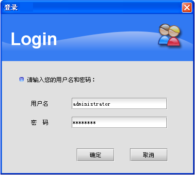
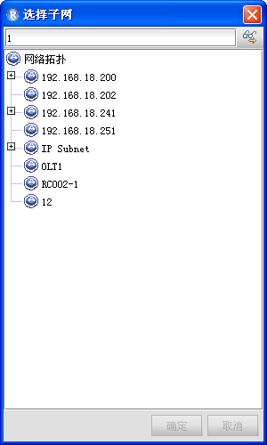

NView NNM(V5) 网络节点管理系统

操作指南

(RC551E(C) 网元管理)(Rel_40)

瑞斯康达科技发展股份有限公司（以下简称“瑞斯康达”）为客户提供全方位的技术支持和服务。直接向瑞斯康达购买产品的用户，如果在使用过程中有任何问题，可与瑞斯康达各地办事处或用户服务中心联系，也可直接与公司总部联系。

读者如有任何关于瑞斯康达产品的问题，或者有意进一步了解公司其他相关产品，可通过下列方式与我们联系：

公司网址： http://www.raisecom.com

技术支持热线： 400-890-1001，8610-82883110（7×24小时）

技术支持传真： 8610-82885200，8610-82884411

技术支持邮箱： help@raisecom.com

技术文档邮箱： rcdoc@raisecom.com

客户投诉热线： 8610-82345572

公司总部地址： 北京市海淀区西北旺东路10号院（中关村软件园）东区11号

邮政编码： 100094

―――――――――――――――――――――――――――――――――――――――――――――

**声  明**

Copyright ©**2022**

瑞斯康达科技发展股份有限公司

版权所有，保留一切权利。

非经本公司书面许可，任何单位和个人不得擅自摘抄、复制本书内容的部分或全部，并不得以任何形式传播。

是瑞斯康达科技发展股份有限公司的注册商标。

对于本手册中出现的其它商标，由各自的所有人拥有。

由于产品版本升级或其它原因，本手册内容会不定期进行更新。除非另有约定，本手册仅作为使用指导，本手册中的所有陈述、信息和建议不构成任何明示或暗示的担保。

前 言

概述

本文档系统介绍了RC551E(C)产品网元管理器支持的功能特性及其管理方法。主要内容包括使用RC551E(C)产品网元管理器实现拓扑管理、设备管理、业务管理、告警管理、性能管理等的方法和过程。在本文档的附录中，提供了设备的告警列表和性能列表，以及本文档所涉及到的术语和缩略语。

阅读本文档有助于读者系统掌握RC551E(C)产品网元管理器的使用和配置方法。

产品版本

与本文档相对应的产品版本如下所示。

| 产品名称                   | 硬件版本   | 软件版本    |
|----------------------------|------------|-------------|
| RC551E-GE网络节点管理系统  | C.00及以上 | V1.00及以上 |
| RC551E-4GE网络节点管理系统 | C.00及以上 | V1.00及以上 |

与本文档相对应的网管系统版本如下所示。

| 网管系统名称              | 网管系统版本 |
|---------------------------|--------------|
| NView NNM网络节点管理系统 | V5           |

与本文档相对应的网元管理器版本如下所示。

| 网元管理器名称  | 网元管理器版本 |
|-----------------|----------------|
| RC552网元管理器 | V5.2           |

约定

符号约定

在本文中可能出现下列标志，它们所代表的含义如下。

| 符号                                                    | 说明                                                                                                           |
|---------------------------------------------------------|----------------------------------------------------------------------------------------------------------------|
|  | 以本标志开始的文本表示有潜在危险，如果不能避免，可能导致人员伤害。                                             |
|  | 以本标志开始的文本表示有潜在风险，如果忽视这些文本，可能导致设备损坏、数据丢失、设备性能降低或不可预知的结果。 |
|  | 以本标志开始的文本是正文的附加信息，是对正文的强调和补充。                                                     |
|  | 以本标志开始的文本能帮助您解决某个问题或节省您的时间。                                                         |

通用格式约定

| 格式           | 说明                                                                                             |
|----------------|--------------------------------------------------------------------------------------------------|
| 宋体           | 正文采用宋体表示。                                                                               |
| 黑体           | 一级标题、二级标题、三级标题、Block采用黑体表示。                                                |
| 楷体           | 警告、提示等内容用楷体表示。                                                                     |
| Lucida Console | Lucida Console表示屏幕输出信息。此外，屏幕输出信息中夹杂的用户从终端输入的信息采用加粗字体表示。 |
| **粗体**       | 命令行关键字（命令中保持不变、必须照输的部分）采用**粗体**表示。                                 |

图形界面元素引用约定

| 格式  | 说明                                                                                                                                         |
|-------|----------------------------------------------------------------------------------------------------------------------------------------------|
| \< \> | 带尖括号\< \>的格式表示各类按钮、按键名称，如单击\<确定\>。                                                                                  |
| [ / ] | 带方括号[ ]的格式表示各类窗口、菜单名称，多级菜单用“/”隔开。如选择[文件/新建/文件夹]，表示选择[文件]菜单下的[新建]子菜单下的[文件夹]菜单项。 |

键盘操作约定

| 格式       | 说明                                                                                         |
|------------|----------------------------------------------------------------------------------------------|
| 加“”的字符 | 表示键名。如“Enter”、“Alt”、“Ctrl”、“a”等分别表示回车、换挡、控制、字母a。                   |
| “键1+键2”  | 表示在键盘上同时按下几个键。如“Ctrl+Alt+Delete”表示同时按下“Ctrl”、“Alt”、“Delete”这三个键。 |
| “键1，键2” | 表示先按第一键，释放，再按第二键。如“Alt，B”表示先按“Alt”键，释放后再按“B”键。               |

鼠标操作约定

| 格式 | 说明                                   |
|------|----------------------------------------|
| 单击 | 快速按下并释放鼠标的一个按钮。         |
| 双击 | 连续两次快速按下并释放鼠标的一个按钮。 |
| 拖动 | 按住鼠标的一个按钮不放，移动鼠标。     |

修订记录

修订记录累积了每次文档更新的说明。最新版本的文档包含以前所有文档版本的更新内容。

文档版本 40 (2021-12-20)

第一次正式发布。

目 录

[1 概述](#_Toc95379847)

[1.1 功能简介](#_Toc95379848)

[1.2 功能特性](#_Toc95379849)

[1.3 设备简介](#_Toc95379850)

[1.4 网管协议](#_Toc95379851)

[2 设备连接网管配置](#_Toc95379852)

[2.1 网管方式概述](#_Toc95379853)

[2.1.1 带内网管](#_Toc95379854)

[2.1.2 带外网管](#_Toc95379855)

[2.2 配置带内网管](#_Toc95379856)

[2.3 配置带外网管](#_Toc95379857)

[2.4 配置SNMP共同体](#_Toc95379858)

[2.5 配置Trap上报目标地址](#_Toc95379859)

[2.6 检查配置](#_Toc95379860)

[3 NView NNM](#nview-nnm)

[3.1 系统监控](#_Toc95379862)

[3.1.1 服务管理功能](#服务管理功能)

[3.1.2 监控功能](#监控功能)

[3.1.3 其他管理功能](#其他管理功能)

[3.2 启动/关闭NView NNM](#_Toc95379866)

[3.2.1 启动网络管理服务器](#启动网络管理服务器)

[3.2.2 检查服务启动状态（启动网络管理客户端）](#_Toc95379868)

[3.2.3 启动客户端](#_Toc95379869)

[3.2.4 关闭客户端](#_Toc95379870)

[3.2.5 停止网管所有服务](#停止网管所有服务)

[3.2.6 关闭网络管理服务器](#关闭网络管理服务器)

[3.3 拓扑管理](#_Toc95379873)

[3.3.1 网络拓扑图](#网络拓扑图)

[3.3.2 网络拓扑树](#网络拓扑树)

[3.4 快捷菜单](#_Toc95379876)

[3.5 同步网元数据](#_Toc95379877)

[3.6 RC551E(C)网元管理器](#_Toc95379878)

[3.6.1 功能入口](#功能入口)

[3.6.2 界面说明](#界面说明)

[3.7 设备属性](#_Toc95379881)

[3.7.1 编辑设备属性信息](#_Toc95379882)

[3.7.2 查看设备属性信息](#_Toc95379883)

[4 基础配置](#基础配置)

[4.1 配置SSH](#_Toc95379885)

[4.2 配置设备厂商信息](#_Toc95379886)

[4.3 升级/备份](#_Toc95379887)

[4.3.1 概述](#_Toc95379888)

[4.3.2 通过FTP/TFTP方式升级/备份系统软件](#_Toc95379889)

[4.4 配置时间管理](#_Toc95379890)

[4.4.1 配置系统时间](#配置系统时间)

[4.4.2 配置夏令时](#配置夏令时)

[4.4.3 检查配置](#_Toc95379893)

[4.5 配置接口管理](#_Toc95379894)

[4.5.1 配置接口物理属性](#_Toc95379895)

[4.5.2 配置接口允许通过的最大帧长](#_Toc95379896)

[4.5.3 配置接口业务属性](#配置接口业务属性)

[4.6 保存配置](#_Toc95379898)

[4.7 开启操作通告](#_Toc95379899)

[4.8 重新启动](#_Toc95379900)

[4.9 删除配置](#_Toc95379901)

[4.10 清除内存文件](#_Toc95379902)

[5 以太网](#以太网)

[5.1 简介](#_Toc95379904)

[5.1.1 VLAN](#_Toc95379905)

[5.2 配置VLAN](#_Toc95379906)

[5.2.1 配置准备](#_Toc95379907)

[5.2.2 创建VLAN](#_Toc95379908)

[5.2.3 配置接口模式以及接口的VLAN](#_Toc95379909)

[5.2.4 检查配置](#_Toc95379910)

[6 QoS配置](#_Toc95379911)

[6.1 简介](#_Toc95379912)

[6.1.1 基于接口的流量限速](#_Toc95379913)

[6.2 配置基于接口流量限速](#_Toc95379914)

[6.2.1 配置准备](#配置准备-1)

[6.2.2 配置入方向接口限速](#配置入方向接口限速)

[6.2.3 配置出方向接口限速](#配置出方向接口限速)

[6.2.4 检查配置](#检查配置-3)

[7 安全](#安全)

[7.1 简介](#_Toc95379920)

[7.1.1 风暴抑制](#_Toc95379921)

[7.2 配置风暴抑制](#_Toc95379922)

[7.2.1 配置准备](#_Toc95379923)

[7.2.2 配置风暴抑制功能](#_Toc95379924)

[7.2.3 检查配置](#_Toc95379925)

[7.3 配置举例](#_Toc95379926)

[7.3.1 配置风暴抑制应用示例](#_Toc95379927)

[8 系统管理与维护](#_Toc95379928)

[8.1 简介](#_Toc95379929)

[8.1.1 光模块数字诊断](#_Toc95379930)

[8.1.2 CPU监控](#_Toc95379931)

[8.2 配置光模块数字诊断](#_Toc95379932)

[8.2.1 配置准备](#_Toc95379933)

[8.2.2 配置使能光模块数字诊断](#_Toc95379934)

[8.2.3
接口使能光模块数字诊断以及告警管理功能](#接口使能光模块数字诊断以及告警管理功能)

[8.2.4 检查配置](#_Toc95379936)

[8.3 配置CPU监控](#_Toc95379937)

[8.3.1 配置准备](#_Toc95379938)

[8.3.2 查看CPU监控信息](#_Toc95379939)

[8.3.3 配置CPU监控告警](#_Toc95379940)

[8.3.4 检查配置](#_Toc95379941)

[9 告警管理](#_Toc95379942)

[9.1 概述](#_Toc95379943)

[9.1.1 告警状态](#_Toc95379944)

[9.1.2 操作状态](#_Toc95379945)

[9.2 告警查看](#_Toc95379946)

[9.2.1 当前告警](#_Toc95379947)

[9.2.2 历史告警](#_Toc95379948)

[9.3 告警过滤](#_Toc95379949)

[9.3.1 添加设备过滤规则](#_Toc95379950)

[9.3.2 添加端口过滤规则](#_Toc95379951)

[10 性能管理](#_Toc95379952)

[10.1 概述](#_Toc95379953)

[10.2 性能监控服务](#_Toc95379954)

[10.2.1 简介](#_Toc95379955)

[10.2.2 启动性能监控服务](#_Toc95379956)

[10.3 监控实时性能](#_Toc95379957)

[10.3.1 简介](#_Toc95379958)

[10.3.2 配置监控实时性能](#_Toc95379959)

[10.4 配置性能监控任务](#_Toc95379960)

[10.4.1 简介](#_Toc95379961)

[10.4.2 配置单点任务](#_Toc95379962)

[10.4.3 启动采集任务](#_Toc95379963)

[10.4.4 停止采集任务](#_Toc95379964)

[10.5 历史性能](#_Toc95379965)

[10.5.1 简介](#_Toc95379966)

[10.5.2 浏览历史性能图](#_Toc95379967)

[11 数据中心](#数据中心)

[11.1 简介](#_Toc95379969)

[11.2 启动](#_Toc95379970)

[11.3 设备操作管理](#_Toc95379971)

[11.3.1 升级](#_Toc95379972)

[11.3.2 定时升级](#_Toc95379973)

[11.3.3 备份](#_Toc95379974)

[11.3.4 周期性自动备份](#周期性自动备份)

[12 附录](#_Toc95379976)

[12.1 术语](#_Toc95379977)

[12.2 缩略语](#_Toc95379978)

# 概述

本章主要介绍了RC551E(C)产品网元管理器的功能特点。

-   功能简介

-   功能特性

-   设备简介

-   网管协议

## 功能简介

RC551E(C)产品网元管理器能够提供图形化的拓扑显示，与真实设备外形一致的面板视图，能反映设备拓扑连接关系和设备状态，并能提供集中而且快捷的设备监控和维护方法。

用户只需安装NView NNM（Network Node Management
System，网络节点管理系统），配置SNMP信息、Trap主机等网管参数，就可管理设备，从而完成配置管理、告警管理、运行与维护等功能。

## 功能特性

强大的拓扑管理

-   手动规划网络拓扑。通过NNM拓扑组件提供的操作，用户可以创建各种类型的拓扑节点，以及节点间的各种链路连接关系，从而构成贴近自身管理需要的逻辑拓扑视图。

-   自动规划网络拓扑。NNM的设备发现功能支持探测指定网段或指定IP段中可以管理的设备，用户可以通过该功能快速添加可管设备，快速的完成拓扑的构建，极大的提高了系统部署的效率。

-   支持设备脱网监测。通过系统提供的设备脱网监测服务，用户可以分层次、分级别的对设备的脱网状态进行监控，并以告警的形式提示设备脱网。

-   支持拓扑树节点与拓扑图节点实时选择联动。

-   节点管理对象的快速搜索定位，根据IP地址或节点名称，在拓扑图中快速查找定位管理对象。

-   实时的告警状态映射，通过告警的节点采用不同的颜色作为背景色，展现节点当前的最高告警级别，并可以快速查看该节点上所有告警的详细信息。

-   提供丰富的自动布局方式，例如：树形、星形、网格型等。

-   网络拓扑浏览导航功能，并提供网络拓扑的缩放、还原、预览等图形操作功能。

-   提供子网同层展开、节点移动、复制等快捷的操作方式，方便操作。

    灵活的安全管理

-   分级、分权、分域的安全控制策略，系统支持基于设备对管理权限进行区分，实现不同的用户对网络设备有不同的管理权限，满足网络管理的实际需要。

-   可自定义管理域范围，系统管理员可根据设备功能的不同，均衡分配网络管理员的网络管理工作，适应几个人到几十人运维部门的内部管理制度要求。

-   系统提供基于IP地址的用户“访问控制”列表，未在列表中列举的客户端主机无法登录系统。系统还可以配置“可登录时间”限制，在“可登录时间”以外用户也无法登录。

-   提供“非法登录验证”功能，输入用户名和密码的错误次数超过系统设定次数时，该用户将被系统锁定，只有解锁之后该用户才能进行再次登录。

-   支持“多用户登录模式”和“单用户登录模式”，“单用户登录模式”时只有超级管理员administrator用户能够登录，便于在升级维护时进行管理。

-   系统管理员可通过详尽的用户系统操作日志和设备操作日志监控跟踪网络管理员的工作状态。

    全面的告警管理

在告警方面，发生故障或者运行异常的网络设备需要以某种方式将事件报告给运维人员，从而及时有效的排除故障，保证网络的整体运行质量。NNM支持解析设备的各种告警，提供告警事件的详细信息，并能够准确的定位故障发生的位置，以协助管理员在最短的时间内排除故障，保证网络运行的通畅。

NNM的告警管理支持以下告警管理功能：

-   告警状态管理：支持确认/取消确认、告警清除操作、告警状态和历时等信息的查看。

-   告警级别分类：对于不同的告警类型根据其严重程度的不同划分为五个级别。严重程度从高到低依次为：

-   紧急告警（Critical）：最高等级，将导致业务系统中断。用表示。

-   主要告警（Major）：业务系统没有中断，但性能严重下降影响用户业务运作。用表示。

-   次要告警（Minor）：系统出现告警信息但不影响业务系统运行。用表示。

-   提示告警（Warn）：业务系统正常运行，但出现一般性使用问题。用表示。

-   未知告警（Unknown）：无法识别的告警信息。用表示。

-   告警分组显示：系统提供当前告警的实时分组监视功能，通过该功能可以将接收到的告警事件按指定条件进行分组显示，并提供按级别统计计数、定位等功能。

-   告警过滤：支持通过定义过滤策略，指定“某位置上的某类型”的告警不被网管接收。所有过滤的告警可以指定是否存入数据库。

-   告警统计：支持当前告警统计和历史告警统计，用来计算各个网元上的各个级别的告警数量，方便掌握告警的分布状况。

-   告警闪烁：支持对紧急告警的闪烁功能。

    完善的性能管理

在性能管理方面，通过对网络设备间的连通性、误码率、流量等各种性能数据进行监控和分析可以确认业务运行的稳定性，甚至可以通过性能数据发现业务质量下降，预计故障的发生。

设备网元管理器结合NView
NNM性能管理组件，提供了设备的性能数据采集、性能图/数据的查看等功能。支持收集设备运行时的性能数据，并通过图形化的界面进行运行状况的查看。能够方便运维人员了解网络当前和过去一段时间的负载、流量等运行状况，为网络故障预警、排除和网络优化提供依据。

性能管理可以用于运维工作的各个环节：

-   在网络部署过程中，使用性能组件可以对设备进行性能监控，帮助运维人员掌握网络设备部署后的运行状态，便于发现部署过程中的设备运行问题，从而提高网络部署的整体效率。

-   在网络运行初期，通过对关键设备性能的监控，可以发现网络运行中的瓶颈，便于在初期进行网络优化，保证网络部署后快速趋于稳定状态。

-   在网络运维过程中，实时性能监控可以确认设备的运行状态，历史性能监控便于运维人员进行统计记录，基于性能阈值产生的告警能够帮助运维人员监控网络的运行状态。

-   在网络业务不断增长的过程中，设置合理的性能阈值，可以在问题发生前由性能告警通知运维人员予以关注，避免由于性能瓶颈而影响正常业务，便于网络的及时扩容。

-   在故障发生时，运维人员通过历史性能图和数据能够分析故障的可能原因，加快故障的排除。

-   在故障排除后，通过监视实时性能图和数据确认设备的实时工作状态，保证故障被彻底排除。

    优秀的运行与维护功能

NView
NNM使用数据中心完成运行与维护功能。数据中心组件可以统一管理设备的升级、备份、恢复、回滚、激活等操作，同时管理可升级文件、备份文件以及各操作、备份所产生的日志，确保设备升级、备份操作具有更便利的操作性、更简单的维护性以及更高的安全性。

数据中心提供了以下功能特性：

-   网元软件管理功能

-   支持网元软件库管理多个软件版本功能，在导入软件时支持自动识别文件类型和版本的功能；

-   支持对网元软件的版本、状态、激活时间的查询；

-   支持对网元软件的上传、下载、升级、备份和激活；

-   支持软件文件回滚功能，数据中心将软件下载到网元并激活生效后，支持将软件回滚到升级前的版本；

-   支持收集对网元软件的操作日志、备份日志和数据中心日志功能。

-   配置数据管理功能

-   支持查询网元的当前配置数据；

-   支持采集并存储网元的当前配置数据，进而实现配置数据的同步；

-   支持配置网元相关数据，通过下载配置数据到网元并激活，从而实现网元的配置下发功能；

-   支持配置数据回滚功能，数据中心将配置数据下载到网元并激活生效后，将配置数据回滚到修改前的状态；

-   支持配置文件对比功能，通过颜色的不同显示两个配置文件数据的差异；

-   支持将数据中心中的配置文件同设备上的配置文件进行对比；

-   支持收集配置数据的操作日志、备份日志和数据中心日志功能。

## 设备简介

RC551E-4GE是实现SNMP和802.3ahOAM功能、支持DHCP远端零配置功能的10/100/1000M以太网智能终端设备。

RC551E-4GE提供4个1000BASE-T以太网电口、2个1000BASE-X
SFP以太网光口、Console口、SNMP口和Reset复位键。

## 网管协议

RC551E(C)产品网元管理器支持SNMP（Simple Network Management
Protocol，简单网络管理协议）的V1、V2c和V3三个版本，并支持对设备发送的Trap信息进行解析。

SNMP的结构分为Agent和网管系统两部分。Agent是SNMP网络的被管理者，网管系统是SNMP网络的管理者。Agent和网管系统之间通过UDP传送SNMP报文进行通信。

访问控制权限是SNMP中重要的部分，以下是对RC551E(C)产品使用的两种访问控制权限的说明。

-   基于共同体的访问控制

SNMP
Agent为了防止自身及其管理的MIB受到非法（未被授权）访问，提出了共同体的概念。当SNMP
V1和SNMP V2c采用共同体认证时，与设备认可的共同体不符合的SNMP报文将被丢弃。

不同的共同体可以具有只读（read-only）访问权限或读写（read-write）访问权限。具有只读权限的共同体只能对设备信息进行查询，而具有读写权限的共同体除了可以对设备信息进行查询之外还可以对设备进行配置。

-   基于用户的访问控制

SNMP V3采用USM（User-based Security
Model，基于用户的安全模式）和VACM（View-based Access Control
Model，基于视图的访问控制模型）。

USM提出了访问组的概念：一个或多个用户对应一个访问组，每个访问组设定相应的读、写视图，访问组中的用户拥有在该视图内的权限。发送请求的用户所在的访问组必须具有与其请求相应的权限，否则请求不被受理。

VACM通过在管理代理定义的用户所能访问的MIB视图的对应关系，来决定一个SNMP协议操作，是否能够访问一个MIB对象。

# 设备连接网管配置

本章介绍如何配置设备连接网管系统。

-   网管方式概述

-   配置带内网管

-   配置带外网管

-   配置SNMP共同体

-   配置Trap上报目标地址

-   检查配置

## 网管方式概述

### 带内网管

带内管理是指网络的管理控制信息与用户网络的承载业务信息通过同一个链路传送。带内管理的优点是组网灵活，受地域限制较小，通道安全性较带外方式好；缺点是网管信息占用业务带宽，而且如果业务通道不通，网管站将无法远程管理设备。设备进行带内网管的组网图如图2-1所示。

1.  带内网管组网图

### 带外网管

带外管理是指网络的管理控制信息与用户网络的承载业务信息在不同的逻辑信道传送。带外管理的优点是业务通道中断不影响网管站对设备的管理，网管信息传输更加可靠；缺点是单独构建的网管网络受地域限制比较大。

通过网元管理器管理设备之前必须为被管设备配置SNMP网管端口的IP地址，确保网管服务器和设备网管IP地址之间路由可达，另外还需要正确配置SNMP共同体和Trap目标地址相关参数。设备进行带内网管的组网图如图2-2所示。

1.  带外网管组网图

## 配置带内网管

带内网管时，网管系统通过设备业务口来管理，这时需要分配管理VLAN，配置管理IP地址。例如：配置IP地址为192.168.1.2，子网掩码为255.255.255.0，管理VLAN为1的带内管理地址，具体步骤如下：

1.  首先通过Console口连接设备，进入CLI（Command Line
    Interface，命令行界面）的Config配置模式。

    Raisecom\>**enable**

    Password:

    Raisecom\#

    Raisecom\#**config**

    Raisecom(config)\#

    1.  配置管理IP。

        Raisecom(config)\#**interface vlan 1**

        Raisecom(config-vlan1)\#**ip address 192.168.1.2 255.255.255.0**

        Raisecom(config-vlan1)\#**exit**

        Raisecom(config)\#**exit**

        Raisecom\#**write**

## 配置带外网管

带外网管的管理控制信息与用户网络的承载业务信息在不同的逻辑信道传送，这时需要配置带外管理IP地址（使用VLAN
1接口IP地址）。例如：配置SNMP口的IP地址为192.168.2.1，子网掩码为255.255.255.0的带外管理。

带内管理IP和带外管理IP不能在同一个网段内。

配置的具体步骤如下：

1.  首先通过Console口连接设备，进入CLI的Config配置模式。

    Raisecom\#**config**

    1.  配置带外管理IP。

        Raisecom(config)\#**interface vlan 1**

        Raisecom(config-vlan1)\#**ip address 192.168.2.1 255.255.255.0**

        Raisecom(config-vlan1)\#**exit**

        Raisecom\#**write**

## 配置SNMP共同体

缺省情况下，系统已经创建了名为Public的只读权限共同体和名为Private的写权限共同体。当用户需要修改默认共同体权限时，就需要进行设置，具体步骤如下：

1.  首先通过Console口连接设备，进入CLI的Config配置模式。

    Raisecom\>**enable**

    Password:

    Raisecom\#

    Raisecom\#**config**

    Raisecom(config)\#

    1.  配置SNMP读和读写共同体。

        Raisecom(config)\#**snmp-server community public1 ro**

        Raisecom(config)\#**snmp-server community** **private1 rw**

        Raisecom(config)\#**exit**

        Raisecom\#**write**

## 配置Trap上报目标地址

设置Trap目标地址是网管系统正确接收和处理设备告警和事件的前提。例如，网管服务器IP地址为192.168.1.100，则Trap目标地址的设置具体步骤如下：

1.  首先通过Console口连接设备，进入CLI的Config配置模式。

    Raisecom\>**enable**

    Password:

    Raisecom\#

    Raisecom\#**config**

    Raisecom(config)\#

    1.  配置Trap上报地址并设置SNMP的版本。

        Raisecom(config)\#**snmp-server host 192.168.1.100 version 2c public
        udpport 162**

        Raisecom(config)\#**exit**

        Raisecom\#**write**

## 检查配置

配置完成后，请在设备上执行以下命令检查配置结果。

| 序号 | 检查项                            | 说明               |
|------|-----------------------------------|--------------------|
| 1    | Raisecom\#**show snmp community** | 查看共同体配置。   |
| 2    | Raisecom\#**show snmp host**      | 查看Trap信息配置。 |

### 

# NView NNM

本章主要介绍了NView NNM的常用功能。

-   系统监控

-   启动/关闭NView NNM

-   拓扑管理

-   快捷菜单

-   同步网元数据

-   RC551E(C)网元管理器

-   设备属性

    

本手册省略安装NView NNM系统的方法，具体步骤请参见《NView NNM(V5)
网络节点管理系统 安装指南》和《NView NNM(V5) 网络节点管理系统 升级指南》。

## 系统监控

NView NNM提供了系统监控功能，用于对NView
NNM的各种功能组件服务进行监控管理。系统监控可以在启动进程时按照正确的顺序和依赖关系进行启动，在服务出现异常时重启服务并上报告警和记录日志。

### 服务管理功能

系统监控对NView NNM网管系统的主要服务管理功能包括：

-   启动和停止网管所有服务

-   启动和停止单一网管服务

-   设置服务启动模式

-   设置北向接口服务IP地址和端口信息

-   管理产品License信息

### 监控功能

系统监控对NView NNM网管系统的主要监控功能包括：

-   监控服务运行状态

-   查看网管数据库信息

-   查看系统资源信息

-   查看网管组件版本信息

### 其他管理功能

系统监控对NView NNM网管系统的其他管理功能包括：

-   记录用户登录信息日志

-   记录各种管理操作日志

-   记录服务异常信息日志

-   支持告警发送功能

## 启动/关闭NView NNM

请按以下顺序启动NView NNM：

1.  启动网络管理服务器；

2.  启动系统监控，查看NNM“内核服务”是否为“运行中”；

3.  启动客户端。

请按以下顺序关闭NView NNM：

1.  关闭网管所有服务和客户端；

2.  关闭系统监控；

3.  关闭网络管理服务器。

### 启动网络管理服务器

双击执行桌面上的“网络管理服务器”快捷方式，等待服务器启动成功。

NView
NNM默认注册为操作系统服务“NMSServer”，启动模式为自动，系统监控服务可以在操作系统启动后手动启动。

NView NNM V5提供的系统监控功能中，NView
NNM内核服务默认是自动启动的。如果修改为手动启动，则启动NView
NNM之后，需要登录系统监控手动启动内核服务，NView NNM客户端才能正常使用网管功能。

NView NNM所有服务都可以配置为自动启动，即随NView
NNM启动时同时启动。配置方法是登录监控，右键单击服务的记录，通过在快捷菜单中单击[设置启动模式/自动]来完成。

### 检查服务启动状态（启动网络管理客户端）

1.  双击执行桌面上的“系统监控”快捷方式，使用超级管理员用户密码登录。

    1.  查看NView NNM内核服务、数据库服务和同步中心服务是否启动。

        1.  如果未启动，则在服务的右键快捷菜单中单击“启动进程”，启动该服务。

### 启动客户端

启动NView
NNM内核服务和数据库成功后，通过执行桌面上的“客户端”快捷方式启动客户端。在客户端启动连接NView
NNM服务器时，系统提供“选择服务器启动”与“不选择服务器启动”两种模式。

第一次运行时，超级管理员用户名为“administrator”，默认密码为“raisecom”，选择“系统默认域”即可登录。强烈建议用户登录后立即修改账户密码，以确保系统的安全性。

第一次运行客户端时可能会提示用户“客户端不完整，是否立即修复？”单击\<确定\>后自动执行修复操作。修复成功后会提示“客户端资源文件已经构建完成，是否立即启动客户端？”单击\<是\>再次启动客户端。

系统提供的“选择服务器启动”与“不选择服务器启动”两种模式的具体配置方式，请参见《NView
NNM(V5) 网络节点管理系统 操作指南》。

选择服务器启动

NView
NNM客户端默认在“选择服务器启动”模式下运行，执行“客户端”快捷方式后，程序会运行至“选择服务器”界面，如图3-1所示。选择服务器后，单击\<确定\>，进入到客户端登录界面。

1.  选择服务器

不选择服务器启动

在“不选择服务器启动”模式下，执行“客户端”快捷方式后，程序会直接运行至客户端登录界面，如图3-2所示。在该模式下客户端直接使用默认服务器的IP地址进行登录。

1.  客户端登录界面

正确输入用户名、密码后，等待客户端显示拓扑主视图后，客户端启动成功。

### 关闭客户端

停止NView
NNM服务前，请先关闭客户端。单击系统菜单中[系统/退出]，或者单击客户端主界面右上方的\<\>关闭按钮，在弹出的对话框中，单击\<是\>退出客户端。

### 停止网管所有服务

关闭服务器时，双击“系统监控客户端”快捷方式并使用超级管理员用户和密码登录后，在菜单中单击[系统/停止网管所有服务]，弹出如图3-3所示的[确认]对话框，单击\<是\>停止所有服务。

1.  停止服务提示

### 关闭网络管理服务器

启动网络管理服务器后，只能通过从操作系统的服务中停止“NMSServer”服务来停止。

在Windows的[控制面板/管理工具/服务]中打开服务管理界面，右键单击选中“NMSServer”服务，单击\<停止\>。

## 拓扑管理

NView
NNM支持的拓扑管理包括：网络拓扑图和网络拓扑树管理。“拓扑”是所有子网和网元的主界面，可以实现网管网络的子网、符号、网元、链路的拓扑管理功能。使用NView
NNM客户端登录之后，首先打开“拓扑”主视图界面，如图3-4所示。

1.  拓扑主视图

| 1 拓扑树       | 2 菜单栏和工具栏 |
|----------------|------------------|
| 3 拓扑图       | 4 属性和图例     |
| 5 当前告警列表 |                  |

拓扑图和拓扑树上节点的信息是联动的。在拓扑树上选择拓扑对象时，同时也会在拓扑图中选中该对象。

### 网络拓扑图

拓扑图

拓扑图是以图的形式显示某一个网元或者子网的内容，包括各种节点以及节点之间的链路。拓扑图的上方是拓扑操作的工具栏和菜单；在拓扑图的下方是当前告警列表，当拓扑图中的选择状态发生改变时，告警列表中的内容也会随之改变；拓扑图的右侧是属性和图例，列举了所选择节点属性信息和图例说明。拓扑图的结构布局同拓扑主视图。

NView NNM
V5提供了拓扑图例功能，图例中对所有拓扑对象的图形和状态进行说明。单击拓扑功能菜单的[系统/显示/右侧/图例]可以打开图例面板，并支持根据选择的拓扑对象关联显示对应的图例。

拓扑图节点

拓扑图中每一个节点由图标、文本、颜色和装饰物组成，不同的图标用来区分子网、网元、远端板卡和机箱等拓扑对象，并支持显示网元名称、设备名称或IP地址的文本信息。同时图标的颜色展现了当前的最高告警级别，并用黑色表示拓扑对象的脱网状态。

拓扑图中的每一个节点都有四个基本组成部分：

-   图标：由创建节点时选择的图标决定。

-   文本：在图标的下方，支持配置显示网元名称、设备名称或IP地址。

-   颜色：对于子网和设备来说，使用五种颜色来表示告警状态。颜色与系统告警颜色的定义一致，便于识别。

-   对于子网来说，颜色显示的是子网内所有节点中具有最高级别告警状态的节点的颜色。

-   对于网元设备来说，颜色显示的是网元设备的所有当前告警事件中具有最高级别的告警事件所对应的颜色。

-   无告警的拓扑节点显示绿色，黑色表示网元设备脱网。

-   装饰物：不同的装饰物代表不同的状态，例如告警确认状态、离线状态、管理状态等。

    1.  网元上装饰物含义

| 图标                                                        | 名称         | 描述                                                                                          |
|-------------------------------------------------------------|--------------|-----------------------------------------------------------------------------------------------|
|        | 告警过滤     | 为设备添加了告警过滤规则时，在设备顶端显示该图标。 删除告警过滤规则后，刷新设备时图标会消失。 |
|  | 告警确认     | 当设备存在没有确认的告警时，显示该图标。 当设备所有告警都被确认后，不再显示该图标。           |
|      | 关联客户     | 设备与客户进行关联后，显示该图标。 设备上的全部客户关联被清除掉时，刷新设备，图标消失。       |
|            | 告警指示灯   | 设备上的告警指示灯颜色和当前最高告警级别颜色相同。                                            |
|      | 设备脱网     | 当此装饰物出现时，表示该设备Ping不通。                                                        |
|          | 资源同步     | 当此装饰物出现时，表示该节点正在执行“同步”操作，网管系统正在同步设备存量资源信息。            |
|   | 资源同步失败 | 当此装饰物出现时，表示该节点“同步”操作失败，网管系统无法同步设备存量资源信息。                |
|    | 性能采集     | 出现此装饰时，说明对应的节点上部署了性能采集任务。                                            |

创建拓扑子网

在拓扑中部署网元之前，应设计子网的划分结构。网管拓扑在反映实际通信网络拓扑结构的同时，应方便操作人员进行日常的维护操作。

请在需要创建子网的拓扑界面中执行以下操作。

1.  在拓扑主视图、自定义视图或子网拓扑中，在空白处单击右键，在快捷菜单中单击[添加/添加子网]，鼠标变为“+”状态。

    1.  在需要放置子网图标的位置单击鼠标左键，弹出添加子网对话框，如下图所示，参数如下表所示。配置完成后，单击\<保存\>。

        1.  创建完成后弹出确认对话框“是否继续添加”，单击\<是\>，再次执行创建子网操作，单击\<否\>关闭添加子网对话框。

| 参数     | 参数说明                                |
|----------|-----------------------------------------|
| 节点名称 | 配置子网的名称，长度范围不大于100。     |
| 描述信息 | 配置子网的描述信息，长度范围不大于100。 |
| 拓扑类型 | 通过单击左侧的子网类型树选择子网类型。  |

创建网元节点

创建网元节点可以通过两种方式：手动添加和自动发现。

本文档只对手动创建网元节点的方法进行说明，如需了解自动发现的方法，请参见《NView
NNM(V5) 网络节点管理系统 操作指南》。

在NView NNM中手动创建网元节点的执行步骤如下。

1.  在拓扑主视图、自定义视图或子网拓扑中，在空白处单击右键，在快捷菜单中单击[添加/添加设备]，鼠标变为“+”状态。

    

添加网元等拓扑对象时，还可以按照如下操作发起创建拓扑对象的功能。

-   在拓扑工具栏中单击\<\>并选择“添加设备”等快捷菜单。

-   在拓扑功能菜单中单击[编辑/添加]并选择“添加设备”等快捷菜单。

1.  在需要放置网元图标的位置单击鼠标左键，弹出如下图所示的对话框，参数如下表所示。

    1.  配置完成后，单击\<保存\>。

        1.  创建完成后弹出确认对话框“是否继续添加”，单击\<是\>再次执行创建网元操作，单击\<否\>关闭添加网元对话框。

| 参数         | 参数说明                                                                                                                                                                                                                                                                                                                                                                                                                                                      |
|--------------|---------------------------------------------------------------------------------------------------------------------------------------------------------------------------------------------------------------------------------------------------------------------------------------------------------------------------------------------------------------------------------------------------------------------------------------------------------------|
| 基本属性     |                                                                                                                                                                                                                                                                                                                                                                                                                                                               |
| 所在子网     | 通过单击\<\>选择网元所在的子网。 默认选择发起添加网元操作的子网。                                                                                                                                                                                                                                                                                                                                  |
| 网元名称     | 配置网元节点的名称，长度范围不大于100。                                                                                                                                                                                                                                                                                                                                                                                                                       |
| SSH端口      | 配置SSH端口号，取值范围是1～65535. 缺省情况下，SSH端口号是22。                                                                                                                                                                                                                                                                                                                                                                                                |
| Telnet端口   | 配置Telnet端口号，取值范围是1～65535. 缺省情况下，Telnet端口号是23。                                                                                                                                                                                                                                                                                                                                                                                          |
| IP地址       | 配置网元的IP地址，点分十进制。                                                                                                                                                                                                                                                                                                                                                                                                                                |
| 型号         | 通过在对话框左侧的设备类型树中，单击设备类型选择网元的设备型号。 配置IP地址和型号后，单击\<校验网元类型\>可以显示该IP地址的设备型号，请根据校验的结果选择正确的设备型号。                                                                                                                                                                                                                                                                                     |
| 上联网元     | 单击\<\>配置设备的上联网元。                                                                                                                                                                                                                                                                                                                                                                       |
| 上联端口     | 单击\<\>配置设备的上联接口。 配置设备的上联接口时，需先配置上联网元。                                                                                                                                                                                                                                                                                                                              |
| 用途         | 选择网元的用途。 未指定 普通客户接入 大客户接入 小区汇聚 局站汇聚 中继传输 PTN（B.00及以上） 小型化接入PTN（B.00及以上） MSAP（B.00及以上）                                                                                                                                                                                                                                                                                                                   |
| 供应商       | 配置网元的供应商信息，长度范围不大于100。                                                                                                                                                                                                                                                                                                                                                                                                                     |
| 局端/远端    | 配置网元是局端设备或是远端设备。                                                                                                                                                                                                                                                                                                                                                                                                                              |
| 序列号       | 配置网元的序列号，长度范围不大于100。                                                                                                                                                                                                                                                                                                                                                                                                                         |
| 备注         | 配置网元的备注信息，长度范围不大于100。                                                                                                                                                                                                                                                                                                                                                                                                                       |
| 管理属性     |                                                                                                                                                                                                                                                                                                                                                                                                                                                               |
| 读共同体     | 配置网元的SNMP读共同体信息，长度范围不大于32。                                                                                                                                                                                                                                                                                                                                                                                                                |
| 写共同体     | 配置网元的SNMP写共同体信息，长度范围不大于32。                                                                                                                                                                                                                                                                                                                                                                                                                |
| 重试         | 配置网元脱网检测的重试次数，取值范围是1～5，单位是次，默认是1次。                                                                                                                                                                                                                                                                                                                                                                                             |
| 超时（秒）   | 配置网元的SNMP超时时间，取值范围是1～30，单位是s，默认是3s。 超过超时时间后NView NNM认为SNMP管理操作失败。                                                                                                                                                                                                                                                                                                                                                    |
| SNMP端口     | 配置网元的SNMP目的通信端口，取值范围是1～65535。 SNMP目的端口必须与设备实际使用的SNMP接收端口相同才能正常网管。 默认使用161端口，建议不要进行更改。                                                                                                                                                                                                                                                                                                           |
| SNMP版本     | 选择网元的SNMP协议版本。 SNMP V1 SNMP V2c SNMP V3 默认是SNMP V2c。                                                                                                                                                                                                                                                                                                                                                                                            |
| SNMP V3参数  | 当SNMP版本选择SNMP V3时，配置相关参数。 单击参数文本框后，单击\<\>进行配置以下参数。 用户名称：设备的SNMP V3用户名； 安全等级：设备的SNMP安全认证模式，支持“noAuth,noPriv”（无认证无加密）、“Auth,noPriv”（有认证无加密）、“Auth,Priv”（有认证有加密）； 授权协议：设备的认证类型，支持MD5和SHA； 授权密码：SNMP认证密钥； Privacy协议：设备的加密类型，支持DES和AES； Privacy密码：SNMP加密密钥。 |
| 脱网检测     |                                                                                                                                                                                                                                                                                                                                                                                                                                                               |
| 离线状态监控 | 选择网元脱网检测使能状态。 勾选：使能； 取消勾选：禁止。 缺省情况下，勾选该参数，即使能。                                                                                                                                                                                                                                                                                                                                                                     |
| 监控方式     | 选择脱网检测使用的检测方式。 ICMP Ping SNMP Ping 缺省情况下，监控方式是SNMP Ping。                                                                                                                                                                                                                                                                                                                                                                            |
| 轮询间隔     | 选择脱网检测的周期。 60秒 5分钟 15分钟 30分钟 60分钟 缺省情况下，轮询间隔是30分钟。                                                                                                                                                                                                                                                                                                                                                                           |
| 扩展属性     |                                                                                                                                                                                                                                                                                                                                                                                                                                                               |
| 网格名称     | 配置网元的网格名称，长度范围不大于100。                                                                                                                                                                                                                                                                                                                                                                                                                       |
| 网格ID       | 配置网元的网格ID。                                                                                                                                                                                                                                                                                                                                                                                                                                            |
| 工程属性     |                                                                                                                                                                                                                                                                                                                                                                                                                                                               |
| 所在区域     | 配置网元所在的区域，长度范围不大于100。                                                                                                                                                                                                                                                                                                                                                                                                                       |
| 产权单位     | 配置网元的产权单位信息，长度范围不大于100。                                                                                                                                                                                                                                                                                                                                                                                                                   |
| 使用单位     | 配置网元的使用单位信息，长度范围不大于100。                                                                                                                                                                                                                                                                                                                                                                                                                   |
| 经度位置     | 配置网元的经度位置信息，长度范围不大于100。                                                                                                                                                                                                                                                                                                                                                                                                                   |
| 纬度位置     | 配置网元的纬度位置信息，长度范围不大于100。                                                                                                                                                                                                                                                                                                                                                                                                                   |
| 所属局站     | 配置网元的所属局站信息，长度范围不大于100。                                                                                                                                                                                                                                                                                                                                                                                                                   |
| 所属工程     | 配置网元所属的工程信息，长度范围不大于100。                                                                                                                                                                                                                                                                                                                                                                                                                   |
| 所属机房     | 配置网元所属的机房信息，长度范围不大于100。                                                                                                                                                                                                                                                                                                                                                                                                                   |
| 所属机架     | 配置网元所属的机架信息，长度范围不大于100。                                                                                                                                                                                                                                                                                                                                                                                                                   |
| 承包商       | 配置网元所属的承包商信息，长度范围不大于100。                                                                                                                                                                                                                                                                                                                                                                                                                 |
| 维护人       |                                                                                                                                                                                                                                                                                                                                                                                                                                                               |
| 联系人       | 通过单击\<\>选择联系人。                                                                                                                                                                                                                                                                                                                                                                           |
| 联系电话     | 根据选择的联系人的联系电话信息自动配置。                                                                                                                                                                                                                                                                                                                                                                                                                      |
| 联系地址     | 根据选择的联系人的联系地址信息自动配置。                                                                                                                                                                                                                                                                                                                                                                                                                      |

### 网络拓扑树

拓扑树

拓扑树以树状呈现网管拓扑中的子网、网元和符号。拓扑树中以“先子网后网元”的形式进行显示。

拓扑树是以层级的方式显示所有的子网、设备、机箱以及板卡节点，同时也提供了与拓扑图相同的功能。通过拓扑树，可以直观、完整地看到所有的子网、设备以及板卡的层级关系，告警状态离线状态等。

拓扑树图标

拓扑树上各个小图标及功能介绍，详见表3-2。

1.  拓扑树小图标及功能介绍

| 图标                                                     | 名称          | 描述                                                                                   |
|----------------------------------------------------------|---------------|----------------------------------------------------------------------------------------|
|  | 正排序/倒排序 | 按数字和字母顺序/倒序排序。                                                            |
|  | 全展开/全收缩 | 展开/收缩拓扑树。                                                                      |
|  | 快速查询      | 配置关键字查找拓扑树中的拓扑对象名称，根据配置框中的文字在网络拓扑树上查找匹配的节点。 |
|                                                          | 展开          | 展开树中的拓扑对象。                                                                   |
|                                                          | 收缩          | 收缩树中的拓扑对象。                                                                   |
|       | 离线标记      | 当拓扑树节点右上角显示此标记时，表示该节点处于离线状态                                 |

## 快捷菜单

设备网元管理器的右键快捷菜单支持如表3-3功能。

1.  右键快捷菜单

| 功能          | 参数说明                                                                                                                                                                                                                           |
|---------------|------------------------------------------------------------------------------------------------------------------------------------------------------------------------------------------------------------------------------------|
| 锁定/解锁坐标 | 锁定/解锁该网元节点在拓扑图中的坐标。                                                                                                                                                                                              |
| 编辑          | 编辑网元节点： 编辑属性：编辑该网元节点的设备属性信息； 移动到：将该网元节点移动到其他的子网。                                                                                                                                     |
| 修改网元IP    | 修改网元的IP地址，点分十进制形式。  修改网元IP地址时，要确保修改前后的网元类型一致，否则会导致网元信息丢失。 修改网元IP地址，只会修改网管侧的IP地址，不会修改设备侧的地址。 |
| 删除          | 删除该网元节点。                                                                                                                                                                                                                   |
| 查看属性      | 查看该网元节点的设备属性信息。                                                                                                                                                                                                     |
| 资源同步      | 同步该网元节点的信息。                                                                                                                                                                                                             |
| 网元管理      | 通过网元管理器对设备进行管理。                                                                                                                                                                                                     |
| 告警管理      | 对网元节点的告警信息进行管理： 告警查看：查看告警信息； 告警过滤：对告警信息进行过滤。                                                                                                                                             |
| 相关资源      | 显示设备的相关资源信息： 机箱列表 远端板卡列表 局端板卡列表 端口列表 子网网元统计                                                                                                                                                  |
| 性能管理      | 对设备进行性能管理： 性能图：显示设备的性能图； 单点配置：对设备进行单点配置。                                                                                                                                                     |
| 工具          | 提供相关工具： ICMP Ping Native Ping SNMP Ping Telnet SSH MIB Browser                                                                                                                                                              |

## 同步网元数据

创建网元后，NView
NNM自动执行网元同步操作，网元会同步设备、端口的资源数据。如果设备发生变更，或者需要手动同步网元数据时请先执行同步网元数据操作。当设备配置信息发生变化时，会导致NView
NNM维护的设备数据与设备本身的状态不一致，这时用户可以采用同步的办法收集设备当前的最新信息并更新拓扑。

1.  在拓扑主视图或子网拓扑中，在需要进行同步的网元图标上单击右键，在快捷菜单中单击[资源同步]。

    1.  弹出确认框，提示“同步命令已发送”，单击\<确定\>。

        1.  网元图标上方显示，表示正在执行同步。

            1.  等待消失后，表示完成同步网元数据。

                

-   资源同步也可以从存量管理中发起，具体配置步骤，请参见《NView NNM(V5)
    网络节点管理系统 操作指南》。

-   发起资源同步操作时，设备会先关闭自动保存配置功能；当资源同步完成后，设备会自动启动保存配置功能。

## RC551E(C)网元管理器

### 功能入口

RC551E(C)网元管理器的入口有两种：

-   在NView
    NNM的拓扑图中选中设备节点，单击鼠标右键，在快捷菜单中选择[网元管理]；

-   在NView NNM的拓扑树中选中设备节点，直接双击设备节点，发起网元管理视图。

### 界面说明

进入设备网元管理器的初始定位界面是“设备快照”，A.00及以上产品设备快照如图3-5所示，B.00及以上产品设备快照如下图所示。

1.  产品设备快照

| 1 设备列表 | 2 操作列表 |
|------------|------------|
| 3 配置面板 |            |

RC551E(C)产品网元管理器主界面分为3个部分：

-   设备列表：以列表的形式显示设备类型是RC551E(C)产品的设备名称，其中设备的名称默认显示的是设备的IP地址。

-   操作列表：网元管理器左侧的树状列表即为操作列表，列举了设备所支持的功能特性。用户通过双击操作列表中的功能特性，即可在右侧的功能配置区域中对设备进行该功能的配置。

-   配置面板：在左侧的操作列表中选择功能特性时，会在该区域显示对应的配置项，用户可在此对设备进行详细的配置。上图是在操作列表中选择了[设备管理/设备快照]后，显示的界面。

    

在功能配置区域中常用操作的发起方式如下：

-   添加：通过单击\<添加\>或\<\>；右键单击界面中已添加的项目，在快捷菜单中选择[添加]；

-   删除：通过单击\<删除\>或\<\>；右键单击界面中要删除的项目，在快捷菜单中选择[删除]；

-   修改：通过单击\<修改\>；右键单击界面中要删除的项目，在快捷菜单中选择[修改]；

-   查看：通过单击\<查看\>或\<\>；右键单击界面中要查看的项目，在快捷菜单中选择[查看]；

-   重置：在配置界面中，通过单击\<重置\>，对未完成的配置进行擦除。

本文只是介绍了通过按钮的发起方式，如果界面没有按钮，则通过右键快捷菜单或配置菜单。

对网元管理器功能配置区域文本框的说明如下：

-   文本框填写完参数后，显示绿色，说明输入值在取值范围内是合法的，但不说明在业务配置上是合理的。

-   文本框填写完参数，显示红色，说明输入值在取值范围内是不合法的，请修正。

## 设备属性

### 编辑设备属性信息

修改设备属性中SNMP版本或共同体参数后，如果与设备SNMP参数不匹配时，将导致对设备无法网管，请谨慎使用。

1.  在网络拓扑中选中需要编辑设备属性的节点，单击右键快捷菜单中的[编辑/编辑属性]。

    1.  弹出“编辑”对话框，如下图所示，设备属性的参数说明详见下表。

        1.  编辑完成后，单击\<保存\>，保存配置。

| 参数         | 参数说明                                                                   |
|--------------|----------------------------------------------------------------------------|
| 基本属性     |                                                                            |
| 网元名称     | 修改网元节点的名称，默认为设备的IP地址。                                   |
| 用途         | 选择设备的用途： 未指定 普通客户接入 大客户接入 小区汇聚 局站汇聚 中继传输 |
| 备注         | 修改设备的备注信息。                                                       |
| 管理属性     |                                                                            |
| 读共同体     | 修改网元节点的读共同体。                                                   |
| 写共同体     | 修改网元节点的写共同体。                                                   |
| 重试         | 修改重试次数，取值范围是1～5。                                             |
| 超时         | 修改超时时间，取值范围是1～30，单位是s。                                   |
| SNMP端口     | 修改SNMP端口号，取值范围是1～65535，默认是161。                            |
| SNMP版本     | 选择SNMP版本号： SNMP V1 SNMP V2c SNMP V3                                  |
| 扩展属性     |                                                                            |
| 网格ID       | 配置设备的网格ID。                                                         |
| 网格名称     | 配置设备的网管名称。                                                       |
| 脱网检测     |                                                                            |
| 离线状态监控 | 选择是否执行离线状态监控： 勾选 不勾选                                     |
| 监控方式     | 选择监控方式： ICMP Ping SNMP Ping                                         |
| 轮询监控     | 选择轮询间隔： 30秒 60秒 5分钟 15分钟 30分钟 60分钟                        |
| 维护人       |                                                                            |
| 维护人       | 修改维护人信息。                                                           |
| 联系电话     | 修改维护人联系电话。                                                       |
| 联系地址     | 修改维护人联系地址。                                                       |
| 工程属性     |                                                                            |
| 所在区域     | 修改设备所在区域。                                                         |
| 所在局站     | 修改设备所在局站信息。                                                     |
| 所属工程     | 修改网元所属工程信息。                                                     |
| 所属机房     | 修改网元所属机房信息。                                                     |
| 所属机架     | 修改网元所属机架信息。                                                     |
| 承包商       | 修改承包商信息。                                                           |

### 查看设备属性信息

1.  在网络拓扑中选中需要查看属性信息的设备节点，在右键快捷菜单中选择[查看属性]。

    1.  在界面右侧的[属性]栏里显示设备的属性信息，参数说明详见下表。

| 参数           | 参数说明                                   |
|----------------|--------------------------------------------|
| 索引           |                                            |
| ID             | 显示网元设备的ID值。                       |
| 基本属性       |                                            |
| 所在子网       | 显示设备所在子网。                         |
| 网元名称       | 显示设备的网元名称。                       |
| IP地址         | 显示设备的IP地址。                         |
| 型号           | 显示设备的型号，例如“RC551E(C)-4GE-L”。    |
| MAC地址        | 显示设备的MAC地址。                        |
| 子网掩码       | 显示设备的子网掩码。                       |
| 用途           | 显示设备的用途。                           |
| 供应商         | 显示设备的供应商信息。                     |
| 支持上行速率表 | 显示设备支持的上行速率。                   |
| K.A.使能       | 显示设备KeepAlive功能是否使能。            |
| K.A.间隔       | 显示设备上报KeepAlive的时间间隔，单位是s。 |
| K.A.上报时间   | 显示KeepAlive的上报时间。                  |
| 软件版本       | 显示设备的软件版本。                       |
| 硬件版本       | 显示设备的硬件版本。                       |
| 管理模式       | 显示设备的管理模式。                       |
| Web管理URL     | 显示设备Web管理的URL。                     |
| 最近同步时间   | 显示设备最近的同步时间。                   |
| 集群身份       | 显示设备在集群中的身份。                   |
| 创建者         | 显示设备节点的创建者。                     |
| 创建时间       | 显示设备节点的创建时间。                   |
| 更新者         | 显示设备节点的更新者。                     |
| 更新时间       | 显示设备节点的更新时间。                   |
| 序列号         | 显示设备节点的序列号。                     |
| 备注           | 显示备注信息。                             |
| 工程属性       |                                            |
| 所在区域       | 显示网元所在的区域。                       |
| 所属局站       | 显示网元所属的局站。                       |
| 所属工程       | 显示网元所属工程信息。                     |
| 所属机房       | 显示网元所属机房信息。                     |
| 所属机架       | 显示网元所属机架信息。                     |
| 承包商         | 显示承包商信息。                           |
| 管理属性       |                                            |
| 读共同体       | 显示设备的读共同体。                       |
| 写共同体       | 显示设备的写共同体。                       |
| 重试           | 显示连接设备的重试次数。                   |
| 超时           | 显示设备未连接的超时时间。                 |
| SNMP端口       | 显示SNMP端口。                             |
| SNMP版本       | 显示SNMP版本。                             |
| 扩展属性       |                                            |
| 网格ID         | 显示设备的网格ID。                         |
| 网格名称       | 显示设备的网格名称。                       |
| 网管VLAN       | 显示设备的网管VLAN ID。                    |
| 用户VLAN       | 显示设备的内层VLAN ID。                    |
| 外层VLAN ID    | 显示设备的外层VLAN ID。                    |
| 局向交换机     | 显示局向交换机。                           |
| 局向端口       | 显示局向端口。                             |
| 上联电路       | 显示上联电路信息。                         |
| 脱网检测       |                                            |
| 离线状态监控   | 显示设备是否执行离线状态监控。             |
| 监控方式       | 显示设备执行离线监控的监控方式。           |
| 轮询间隔       | 显示设备执行离线监控的轮询间隔。           |
| 维护人         |                                            |
| 维护人         | 显示维护人信息。                           |
| 联系电话       | 显示维护人联系电话。                       |
| 联系地址       | 显示维护人联系地址。                       |

# 基础配置

本章介绍RC551E(C)产品的基础配置信息及配置过程。

-   配置SSH

-   配置设备厂商信息

-   升级/备份

-   配置时间管理

-   配置接口管理

-   保存配置

-   开启操作通告

-   重新启动

-   删除配置

-   清除内存文件

## 配置SSH

配置SSH全局属性

1.  在RC551E(C)网元管理器的操作列表中，双击[SNMP管理/高级管理/SSH管理]。

    1.  在配置面板中，单击“全局配置”页签，配置SSH功能基本信息，参数说明详见下表。

        1.  配置完成后，单击\<保存\>。

| 参数                  | 参数说明                                                                                                                  |
|-----------------------|---------------------------------------------------------------------------------------------------------------------------|
| SSH服务器认证超时时间 | 配置设备的SSH认证超时时间，取值范围是100～65535，单位是s。 缺省情况下，设备的SSH认证超时时间是600s。                      |
| SSH服务器认证尝试次数 | 配置设备的SSH认证允许失败次数，取值范围是1～100。 缺省情况下，设备的SSH认证允许失败次数为20。                             |
| SSH服务器使能         | 配置SSH服务器功能状态： 启动：使能SSH服务器功能； 停止：禁用SSH服务器功能。 缺省情况下，禁用SSH服务器功能。               |
| SSH服务器认证类型     | 配置设备的SSH认证方式。 用户密码：使用用户密码认证 RSA共有密钥：使用密钥对进行认证 缺省情况下，设备采用用户密码认证方式。 |
| SSH服务器端口         | 配置设备的SSH侦听TCP接口号，取值范围是1～65535。 缺省情况下，设备的SSHv2侦听接口号是22。                                  |

配置SSH密钥对

1.  在RC551E(C)网元管理器的操作列表中，双击[SNMP管理/高级管理/SSH管理]。

    1.  在配置面板中，单击“SSH密钥对表”页签，单击\<添加\>。

-   选择“公有密钥”，配置“SSH密钥对名称”和“SSH密钥对长度”。

-   选择“SSH密钥”，配置“SSH密钥对长度”。

    1.  配置完成后，单击\<应用\>。

| 参数          | 参数说明                                      |
|---------------|-----------------------------------------------|
| SSH密钥对名称 | 配置公有密钥的密钥对名称，字符串形式。        |
| SSH密钥对长度 | 配置密钥对长度，整数形式，取值范围512～2048。 |

## 配置设备厂商信息

1.  在RC551E(C)网元管理器的操作列表中，双击[SNMP管理/基本管理/厂商信息]。

    1.  在配置面板中，配置设备厂商信息，参数说明详见下表。

        1.  配置完成后，单击\<保存\>。

| 参数       | 参数说明                                                                 |
|------------|--------------------------------------------------------------------------|
| 厂商联系人 | 配置设备厂商的联系人信息，长度范围是0～255，默认是support@raisecom.com。 |
| 厂商位置   | 配置设备厂商的所处位置，长度范围是0～255，默认是World China Raisecom。   |
| 厂商名称   | 配置设备厂商的名称，长度范围是1～32，默认是Raisecom。                    |

## 升级/备份

### 概述

升级

当需要为设备增加新特性、优化原有功能或解决当前软件版本的BUG时，可以对设备进行升级操作。

RC551E(C)网元管理器支持以下几种升级方式：

-   FTP升级方式

-   TFTP升级方式

    备份

当需要以当前时刻作为设备的一个还原点时，可以对当前的配置文件或系统文件进行备份，以防设备发生故障时配置文件的丢失或系统文件的损坏。

### 通过FTP/TFTP方式升级/备份系统软件

在通过FTP/TFTP升级方式升级系统软件前，需要首先搭建FTP/TFTP环境，RC551E(C)设备作为FTP/TFTP客户端，基本要求如下：

-   RC551E(C)设备连接FTP/TFTP服务器；

-   配置FTP/TFTP服务器端，确保服务器处于可用状态且资源存在；

-   配置FTP/TFTP服务器的IP地址，使RC551E(C)设备可以访问FTP/TFTP服务器。

通过FTP/TFTP方式升级系统软件的方法如下：

1.  在RC551E(C)网元管理器的操作列表中，双击[SNMP管理/系统维护/升级/备份]。

    1.  在配置面板中，单击\<添加\>。

        1.  在弹出的对话框中，配置升级/备份任务，参数说明详见下表。

            1.  配置完成后，单击\<应用\>。

| 参数         | 参数说明                                                                                                                                                                                                                             |
|--------------|--------------------------------------------------------------------------------------------------------------------------------------------------------------------------------------------------------------------------------------|
| 传输协议     | 选择升级/备份的传输协议： FTP TFTP                                                                                                                                                                                                   |
| 操作类型     | 选择操作类型： 升级 备份                                                                                                                                                                                                             |
| 文件类型     | 选择升级/备份的文件类型： System-Boot：系统软件； Startup-Config：系统启动时加载的配置文件； Bootstrap：系统引导文件（当“文件类型”配置为“升级”时，支持配置）； loggingfile：运行的配置文件（当“文件类型”配置为“备份”时，支持配置）。 |
| IP版本       | 选择IP版本。 IPv4 IPv6                                                                                                                                                                                                               |
| 服务器IP地址 | 配置FTP/TFTP服务器IP地址，点分十进制形式。                                                                                                                                                                                           |
| 文件名       | 配置升级/备份的文件名。                                                                                                                                                                                                              |
| 用户名       | 如果传输协议选择的是FTP，输入FTP的用户名。                                                                                                                                                                                           |
| 用户密码     | 如果传输协议选择的是FTP，输入FTP的用户密码。                                                                                                                                                                                         |

通过FTP/TFTP升级方式升级系统软件，网管界面会提示升级成功或升级失败。

## 配置时间管理

### 配置系统时间

为了保证RC551E(C)设备与其他设备的协调工作，需要准确设置RC551E(C)设备的系统时间与所属时区。

请在需要配置时间的设备上进行以下配置。

1.  在RC551E(C)网元管理器的操作列表中，双击[SNMP管理/基本管理/时间]。

    1.  在配置面板中，单击“系统时间”页签，在显示的页签框中配置设备的系统时间，参数说明详见下表。

        1.  配置完成后，单击\<保存\>。

| 参数         | 参数分类 | 参数说明                                                                                                                |
|--------------|----------|-------------------------------------------------------------------------------------------------------------------------|
| 时间显示模式 | -        | 选择时间的显示模式： 默认时间显示 世界标准时间显示                                                                      |
| 系统时间     | 系统时间 |                                                                                                                         |
|              | 年       | 输入年，取值范围是2000～2099。                                                                                          |
|              | 月       | 输入月，取值范围是1～12。                                                                                               |
|              | 日       | 输入日，取值范围是1～31。                                                                                               |
|              | 时       | 输入时，取值范围是0～23。                                                                                               |
|              | 分       | 输入分，取值范围是0～59。                                                                                               |
|              | 秒       | 输入秒，取值范围是0～59。                                                                                               |
|              | 时区     |                                                                                                                         |
|              | 偏移     | 选择偏移方向，相对于UTC（Coordinated Universal Time，协调世界时，又称为世界标准时间）而言： +：向东偏移； -：向西偏移。 |
|              | 时偏移   | 配置时偏移量，取值范围是0～11。                                                                                         |
|              | 分偏移   | 配置分偏移量，取值范围是0～59。                                                                                         |

### 配置夏令时

夏令时是一种为节约能源而人为规定地方时间的制度，目前全世界有近110个国家在每年夏天会实行夏令时，但各个国家对夏令时的具体规定不同，所以在配置夏令时前需要考虑当地的具体情况。

当夏令时功能使能后，通过SNTP获取的同步时间都将转换成当地的夏令时时间。

请在需要配置夏令时的设备上进行以下配置。

1.  在RC551E(C)网元管理器主界面左侧的操作列表中，双击[SNMP管理/基本管理/时间]。

    1.  在配置面板中，单击“夏令时”页签，显示如下图所示的页签框，参数说明详见下表。

        1.  配置完成后，单击\<保存\>。

| 参数           | 参数说明                                                                                                                                                                                                           |
|----------------|--------------------------------------------------------------------------------------------------------------------------------------------------------------------------------------------------------------------|
| 夏令时管理     | 选择夏令时管理使能状态： 使能 禁止 默认是禁止。  只有配置“夏令时管理”为“使能”，单击\<保存\>后，才可以配置“夏令时偏移”、“夏令时开始时间”和“夏令时结束时间”。 |
| 夏令时偏移     | 配置夏令时偏移的时间，单位是min。                                                                                                                                                                                  |
| 夏令时开始时间 | 配置夏令时开始的时间，精确到min。                                                                                                                                                                                  |
| 夏令时结束时间 | 配置夏令时结束的时间，精确到min。                                                                                                                                                                                  |

手动设置系统时间时，如果系统使用夏令时，例如夏令时为每年的四月第二个星期天早上2点钟，到九月的第二个星期天早上2点钟，在这个时间区域内时钟拨快一个小时，即时间偏移为60分钟，那么每年的四月第二个星期天早上2点钟到3点钟为不存在时间。手动设置时间在该时间段内的结果是设置失败。

南半球的夏季与北半球相反，他们的夏令时间一般是从9月到次年的4月，假如配置的开始时间比结束时间晚，系统就假定你在南半球，也就是说夏令时是从当年的开始时间到下一年的结束时间。

### 检查配置

配置完成后，请在设备上执行以下操作检查配置结果。

查看设备的系统时间和夏令时的配置是否正确。

-   在RC551E(C)网元管理器的操作列表中，双击[SNMP管理/基本管理/时间]后，在配置面板中单击“系统时间”页签，在显示的页签框中查看系统时间配置是否正确。

-   在RC551E(C)网元管理器的操作列表中，双击[SNMP管理/基本管理/时间]后，在配置面板中单击“夏令时”页签，在显示的页签框中查看夏令时配置是否正确。

## 配置接口管理

以太网以其高度灵活、相对简单、易于实现的特点，成为重要的局域网组网技术。

### 配置接口物理属性

当互连的两个设备的接口属性，如双工模式、速率等参数不一致时，会造成设备间无法正常通信，此时需要调整接口的属性使两端设备互相匹配。

请在需要配置接口基本属性的设备上进行以下配置。

1.  在RC551E(C)网元管理器的操作列表中，双击[SNMP管理/端口管理/端口列表]。

    1.  在配置面板中，单击“物理端口配置表”页签。

        1.  在显示的页签框中，选中端口所在的行，单击\<修改\>，配置端口基本属性参数说明详见下表。

            1.  配置完成后，单击\<应用\>。

| 参数         | 参数说明                                                                                                                                                                                                                                               |
|--------------|--------------------------------------------------------------------------------------------------------------------------------------------------------------------------------------------------------------------------------------------------------|
| 速率管理状态 | 选择端口的速率： 自动协商：链路两端的设备通过交互信息自动选择速率，一旦协商通过，两端的设备就使用同样的速率进行报文传输； 10M速率：10Mbit/s； 100M速率：100Mbit/s； 1000M速率：1000Mbit/s。 默认是自动协商。                                           |
| 双工管理状态 | 选择端口的双工管理状态： 自动协商：链路两端的设备通过交互信息自动选择双工模式，一旦协商通过，两端的设备就使用同样的双工模式进行报文传输； full：全双工，在任意时刻可以同时接收和发送报文； half：半双工在任意时刻只能接收或发送报文。 默认是自动协商。 |

### 配置接口允许通过的最大帧长

1.  在RC551E(C)网元管理器的操作列表中，双击[SNMP管理/端口管理/端口列表]。

    1.  在配置面板中，单击“全局配置”页签。

        1.  配置下表所示参数，配置完成后，单击\<保存\>。

| 参数             | 参数说明                                                                                                    |
|------------------|-------------------------------------------------------------------------------------------------------------|
| 允许通过最大长帧 | 配置允许通过最大长帧。整数形式，取值范围1522～10240，单位是字节。 缺省情况下，接口最大转发帧长是10000字节。 |

### 配置接口业务属性

1.  在RC551E(C)网元管理器的操作列表中，双击[SNMP管理/端口管理/端口列表]。

    1.  在配置面板中，单击“接口配置表”页签。

        1.  在显示的页签框中，选中端口所在的行，单击\<修改\>，配置下表所示参数。

            1.  配置完成后，单击\<应用\>。

| 参数         | 参数说明                                                        |
|--------------|-----------------------------------------------------------------|
| 接口管理状态 | 配置接口管理状态： up down 默认是up。                           |
| 接口模式切换 | 配置接口模式。 switch：交换模式 router：路由模式 默认是switch。 |

## 保存配置

配置完的信息未保存，则下次系统启动时，信息将会丢失。请配置完设备后，执行该操作。

1.  在RC551E(C)网元管理器的操作列表中，双击[SNMP管理/系统维护/保存配置]。

    1.  在弹出的对话框中，单击\<是\>，保存设备配置信息，单击\<否\>，放弃保存。

## 开启操作通告

开启操作通告后，当设备进行保存或者擦除配置信息时，会发送通告信息。

1.  在RC551E(C)网元管理器的操作列表中，双击[SNMP管理/系统维护/操作通告]。

    1.  在“操作通告”下拉列表框中选择“是”，开启操作通告。

## 重新启动

当设备需要重新启动时，可执行如下操作。

未保存配置时，重启设备会导致配置信息丢失，请谨慎使用。

1.  在RC551E(C)网元管理器的操作列表中，双击[SNMP管理/系统维护/重新启动]。

    1.  在弹出的对话框中，单击\<是\>，重新启动设备，单击\<否\>，放弃启动。

## 删除配置

如果设备的信息配置错误，可执行如下操作。

删除配置文件操作会删除设备的所有配置信息，请谨慎使用。

1.  在RC551E(C)网元管理器的操作列表中，双击[SNMP管理/系统维护/删除配置]。

    1.  在弹出的对话框中，单击\<是\>，删除配置信息，单击\<否\>，放弃删除。

## 清除内存文件

1.  在RC551E(C)网元管理器的操作列表中，双击[SNMP管理/系统维护/清除内存文件]。

    1.  在弹出的对话框中，单击\<是\>，清除内存文件，单击\<否\>，放弃清除。

        1.  

# 以太网

本章介绍以太网特性的原理和配置过程，并提供相关的配置案例。

-   简介

-   配置VLAN

## 简介

### VLAN

VLAN概述

VLAN（Virtual Local Area
Network，虚拟局域网）是一种二层隔离技术。它可以将局域网内的计算机逻辑上分为不同的部分，每个部分相互独立，彼此之间不能直接通信，需要通过路由器或三层交换机才能通信，从而实现二层隔离。划分VLAN的目的是隔离广播域，减少广播风暴的产生。如图5-1所示。

1.  VLAN划分示意图

VLAN帧格式

RC551E(C)产品支持IEEE 802.1Q标准的VLAN，支持4094个并发VLAN。IEEE
802.1Q标准对以太网帧格式进行了修改，在源MAC地址字段与协议类型字段间插入4个字节的802.1Q
Tag，如图5-2所示。

1.  基于802.1Q的VLAN帧格式

-   TPID（Tag Protocol
    Identifier，标签协议标识）：IEEE定义的新的帧类型，长度为2B，取值为0x8100时表示802.1Q
    Tag帧，如果不支持802.1Q的设备收到这样的帧，会直接丢弃。

-   Priority：这3位指明帧的优先级，取值范围0～7，越大优先级越高。主要用于网络拥塞时，设备优先发送优先级高的数据帧。

-   CFI（Canonical Format
    Indicator，标准格式指示器）：长度1位，用于标识MAC地址是否是经典格式，0表明为经典格式，1表明为非经典格式。这一位用于区分总线型以太网与FDDI（Fiber
    Distributed Digital
    Interface，光纤分布式数据接口）、令牌环网交换数据时的帧格式。以太网中，CFI值为0。

-   VLAN ID：12位，指明帧所属的VLAN，范围是1～4094。PVID（Port Vlan ID，接口VLAN
    ID）又称为接口缺省VLAN ID。在基于接口划分的VLAN
    中，每个接口都会有一个PVID。当一个Untagged包进入设备接口时，设备根据PVID标签转发数据帧。RC551E(C)设备支持符合IEEE
    802.1Q标准的VLAN，支持4094个并发VLAN。

    接口模式与报文转发

RC551E(C)产品的接口模式分为Access和Trunk两种，接口模式与报文转发处理方式的比较请参见表5-1。

1.  接口模式与报文转发

| 接口类型 | 入报文处理                 | 出报文处理                                                                                                                                          |                                                                                                                                                                                                            |
|----------|----------------------------|-----------------------------------------------------------------------------------------------------------------------------------------------------|------------------------------------------------------------------------------------------------------------------------------------------------------------------------------------------------------------|
|          | Untag报文                  | 带Tag报文                                                                                                                                           |                                                                                                                                                                                                            |
| Access   | 为报文打上Access VLAN Tag  | 报文VLAN ID＝Access VLAN ID或者在接口允许通过的VLAN ID范围内，接收此报文。 报文VLAN ID≠缺省VLAN ID或者不在接口允许通过的VLAN ID范围内，丢弃此报文。 | 报文VLAN ID＝缺省VLAN ID，去掉Tag发送此报文。 接口允许通过的VLAN ID列表中包含报文VLAN ID，去掉Tag发送此报文。 接口允许通过的VLAN ID列表中不包含报文VLAN ID，丢弃此报文。                                   |
| Trunk    | 为报文打上Native VLAN的Tag | 接口允许通过的VLAN ID列表中包含报文VLAN ID，接收此报文。 接口允许通过的VLAN ID列表中不包含报文VLAN ID，丢弃此报文。                                 | 报文VLAN ID＝缺省VLAN ID，且接口允许通过时，去掉Tag发送此报文。 报文VLAN ID≠缺省VLAN ID，且不包括在Untagged表中时，保持原有Tag发送此报文。 报文VLAN ID≠缺省VLAN ID，且接口不允许该VLAN通过时，丢弃此报文。 |

## 配置VLAN

### 配置准备

场景

VLAN最主要功能是划分逻辑网段，通常有2种典型应用模式。

-   一种是在小型局域网中，一台二层设备下划分多个VLAN，用VLAN将所有连接到设备的主机逻辑的划分开，同一个VLAN内的主机之间可以相互通信，不同VLAN间的主机之间无法通信。例如财务部门与其他部门需要划分开，互相不能访问，通常连接主机的接口设置为Access模式。

-   另一种是在稍大型局域网或企业网中，有多台二层设备连接较多的主机，并且设备之间级联，转发数据报文时都携带VLAN
    Tag，多台设备的相同VLAN的接口可以相互通信，不同VLAN的主机之间无法通信。主要用在公司人员及主机数量较多，并且同一个部门所在位置不同，但是要求部门内的主机可以互相访问，需要在多台设备上划分VLAN。如果不同VLAN之间需要通信，则要通过路由器等三层设备。设备之间级联的接口设置为Trunk模式。

当需要为VLAN配置IP地址时，可以为其关联一个三层接口，每一个三层接口将对应一个IP地址并关联一个VLAN。

前提

无

### 创建VLAN

-   缺省情况下，设备已创建VLAN 1～VLAN 4094。

-   缺省情况下，VLAN 1已关联gigaethernet 1/1/1～gigaethernet 1/1/7，VLAN 2～VLAN
    4094已关联gigaethernet 1/1/1～gigaethernet 1/1/6。

1.  在网元管理器的操作列表中，双击[SNMP管理/VLAN管理/VLAN配置]。

    1.  在配置面板中，单击“VLAN配置表”页签。

        1.  在显示的页签框中，单击\<添加\>，弹出如下图所示的界面，参数说明详见下表。

            1.  配置完成后，单击\<应用\>。

| 参数     | 参数说明                                        |
|----------|-------------------------------------------------|
| VLAN ID  | 配置VLAN ID，取值范围是1～4094。                |
| VLAN名称 | 配置VLAN的名称，长度范围是0～32，为选择输入项。 |

### 配置接口模式以及接口的VLAN

请在需要配置接口模式的设备上进行以下配置。

1.  在网元管理器的操作列表中，双击[SNMP管理/VLAN管理/VLAN配置]。

    1.  在配置面板中，单击“端口VLAN配置表”页签。

        1.  在显示的页签框中，选中需要修改接口模式或VLAN的接口所在的行，单击\<修改\>，参数说明详见下表。

            1.  修改完成后，单击\<应用\>。

| 参数                     | 参数说明                                                                                                                                                                                                                                                                                                                                                                          |
|--------------------------|-----------------------------------------------------------------------------------------------------------------------------------------------------------------------------------------------------------------------------------------------------------------------------------------------------------------------------------------------------------------------------------|
| 端口号                   | 显示端口号。                                                                                                                                                                                                                                                                                                                                                                      |
| 端口模式                 | 选择端口模式： Access：只允许一个VLAN通过，且该VLAN ID与接口的缺省VLAN ID相同；Access端口可接收untagged帧（不带VLAN标签的帧），且只发送untagged帧； Trunk：允许多个VLAN通过。如果Trunk接口发送的帧的VLAN Tag与接口的缺省VLAN ID相同，则该帧的VLAN Tag被剥掉，变成Untagged帧发送；如果与接口的缺省VLAN ID不同但允许该VLAN通过，则该帧被原样转发。 所有物理端口默认都是Access类型。 |
| 端口Access VLAN ID       | 当端口模式选为“Access”时，配置该端口缺省的VLAN ID，取值范围是1～4094，默认值为1。                                                                                                                                                                                                                                                                                                 |
| 端口Access允许VLAN列表   | 当端口模式选为“Access”时，配置该端口允许通过的VLAN列表，配置格式为：2,5-16,18或者2 5-16 18，默认值是1。                                                                                                                                                                                                                                                                           |
| 端口Trunk Native VLAN ID | 当端口模式选为“Trunk”时，配置该端口的Native VLAN ID，取值范围是1～4094，默认是1。                                                                                                                                                                                                                                                                                                 |
| 端口Trunk允许VLAN列表    | 当端口模式选为“Trunk”时，配置该端口通过的VLAN列表，配置格式为：2,5-16,18或者2 5-16 18，默认值是1。                                                                                                                                                                                                                                                                                |
| 端口Trunk Untag VLAN列表 | 当端口模式选为“Trunk”时，配置该端口允许剥掉Tag的VLAN或列表，配置格式为：2,5-16,18或者2 5-16 18，默认值是1。                                                                                                                                                                                                                                                                       |

### 检查配置

配置完成后，请在网元管理器上执行以下操作检查配置结果。

1.  查看VLAN配置。

在RC551E(C)网元管理器操作列表中，双击[SNMP管理/VLAN管理/VLAN配置]，在配置面板中，选择“VLAN配置表”页签，在显示的页签框中查看所有VLAN的配置信息。

1.  查看接口VLAN配置信息。

在RC551E(C)网元管理器操作列表中，双击[SNMP管理/VLAN管理/VLAN配置]，在配置面板中，选择“端口VLAN配置表”页签，在显示的页签框中选中端口所在的行，单击\<查看\>，查看端口的VLAN的配置信息。

# QoS配置

本章介绍设备QoS配置相关的基本原理及配置过程，主要内容包括：

-   简介

-   配置基于接口流量限速

## 简介

随着网络应用种类的日益丰富，用户对不同的网络应用提出了不同的服务质量需求，这就需要网络能够根据用户的需求为不同的网络应用分配和调度资源。QoS（Quality
of
Service，服务质量）技术的产生，使网络在发生过载或拥塞时，能够确保重要业务的实时性和完整性，同时保证整个网络的高效运行。

### 基于接口的流量限速

RC551E(C)设备支持基于接口对报文流量进行限速，设备对超出部分流量采取丢弃措施。

## 配置基于接口流量限速

### 配置准备

场景

QoS能够根据用户不同的网络应用提供不同的服务质量，基于接口对网络资源进行分配和调度。

前提

无

### 配置入方向接口限速

1.  在网元管理器的操作列表中，双击[SNMP管理/端口管理/端口限速]。

    1.  在配置面板中，单击“接口入方向限速表”页签，单击\<添加\>。

        1.  配置下表所示参数，单击\<应用\>。

| 参数      | 参数说明                                                              |
|-----------|-----------------------------------------------------------------------|
| 端口      | 配置进行限速的端口，取值范围是1～6。                                  |
| 入方向CIR | 配置入方向承诺信息速率，整数形式，取值范围1～10485760，单位是kbit/s。 |
| 入方向CBS | 配置入方向突发信息速率，整数形式，取值范围1～1024，单位是kbit/s。     |

### 配置出方向接口限速

1.  在网元管理器的操作列表中，双击[SNMP管理/端口管理/端口限速]。

    1.  在配置面板中，单击“接口出方向限速表”页签，单击\<添加\>。

        1.  配置下表所示参数，单击\<应用\>。

| 参数      | 参数说明                                                              |
|-----------|-----------------------------------------------------------------------|
| 端口      | 配置进行限速的端口，取值范围是1～6。                                  |
| 出方向CIR | 配置出方向承诺信息速率，整数形式，取值范围1～10485760，单位是kbit/s。 |
| 出方向CBS | 配置出方向突发信息速率，整数形式，取值范围1～1024，单位是kbit/s。     |

### 检查配置

配置完成后，请在网元管理器上执行以下操作检查配置结果。

1.  查看入方向接口限速配置

在网元管理器的操作列表中，双击[SNMP管理/端口管理/端口限速]，单击“接口入方向限速表”页签，选择一行接口限速信息，单击\<查看\>。

1.  查看出方向接口限速配置

在网元管理器的操作列表中，双击[SNMP管理/端口管理/端口限速]，单击“接口出方向限速表”页签，选择一行接口限速信息，单击\<查看\>。

# 安全

本章介绍安全特性的基本原理和配置过程，并提供相关的配置案例。

-   简介

-   配置风暴抑制

-   配置举例

## 简介

随着互联网技术的不断发展，网络应用日益普及，越来越多的企业借助网络来加速自身的发展。如何在一个开放的网络应用环境中保证自身数据、资源的安全，已经越来越受到人们的关注。此外，有时用户无意识但有破坏性的访问也会导致设备的性能下降，甚至设备异常。

访问控制、用户认证等安全性技术的部署，能够有效的提升网络和设备本身的安全性。

### 风暴抑制

在二层网络的大多数场景中，单播流量都应该远大于广播流量。而如果不对广播、组播流量进行限制，当产生广播风暴时，会耗费大量的网络带宽，造成网络性能的下降，严重影响正常单播报文的转发，甚至造成通信中断。

在二层设备上对网络中产生的广播流量进行限制，则能在广播流量激增时抑制广播风暴的产生，从而保证普通的单播正常转发。

下面几种流量会产生广播流量，所以在二层设备上需要分别为其限定带宽：

-   未知单播流量：目的MAC不在MAC表中的单播流量，二层设备对此种流量进行广播发送。

-   组播流量：目的MAC为组播的流量，二层设备对此种流量一般进行广播发送。

-   广播流量：目的MAC为广播的流量，二层设备此种流量进行广播发送。

## 配置风暴抑制

### 配置准备

场景

在二层网络中配置风暴抑制，可以在网络中广播报文增多时抑制广播风暴的产生，从而保证正常单播报文的转发。

下面几种流量会产生广播流量，所以在二层设备上需要分别为其限定带宽：

-   未知单播流量：目的MAC不在MAC表中的单播流量，二层设备对此种流量进行广播发送。

-   组播流量：目的MAC为组播的流量，二层设备对此种流量一般进行广播发送。

-   广播流量：目的MAC为广播的流量，二层设备此种流量进行广播发送。

    前提

在配置风暴抑制之前，需连接接口并配置接口的物理参数，使接口的物理层状态为Up。

### 配置风暴抑制功能

请在设备上进行以下配置。

1.  在RC551E(C)网元管理器主界面左侧的操作列表中，双击[SNMP管理/高级管理/风暴抑制]。

    1.  在显示的界面中，选中接口及风暴抑制报文类型所在的行，单击\<修改\>，在弹出的对话框中配置对相应报文类型的风暴抑制参数，说明详见下表。

        1.  配置完成后，单击\<应用\>。

            1.  （可选）选中接口及风暴抑制报文类型所在的行，单击\<取消限速\>，取消该接口特定报文类型的风暴抑制功能。

| 参数                 | 参数说明                                                                                                                  |
|----------------------|---------------------------------------------------------------------------------------------------------------------------|
| 风暴抑制报文类型     | 显示所配的风暴抑制报文类型。                                                                                              |
| 风暴抑制模式类型     | Default：缺省配置，即pps pps bps                                                                                          |
| 风暴抑制CBS（kByte） | 配置风暴抑制的承诺突发尺寸阈值。整数形式，取值范围0～512，单位是kByte。                                                   |
| 风暴抑制PPS          | 配置风暴抑制的尺度，整数形式，取值范围是1～262143，单位是pps。                                                            |
| 风暴抑制CIR（kbps）  | 配置风暴抑制的承诺信息速率阈值。当“风暴抑制模式类型”配置为“bps”时需要配置。 整数形式，取值范围是64～2000000，单位是kbit/s |

### 检查配置

配置完成后，请在网元管理器上执行以下操作检查配置结果。

在RC551E(C)网元管理器主界面左侧的操作列表中，双击[SNMP管理/高级管理/风暴抑制]，在显示的界面中，选中端口及其抑制的特定报文类型所在的行，单击\<查看\>，在弹出的对话框中查看设备接口风暴抑制配置是否正确。

## 配置举例

### 配置风暴抑制应用示例

组网需求

如图7-1所示，为限制广播风暴对设备的影响，需要在设备上部署风暴抑制特性，限制广播报文和未知单播报文，阈值为2000pps。

1.  风暴抑制应用组网示意图

配置步骤

1.  在设备网元管理器操作列表中，双击[SNMP管理/高级管理/风暴抑制]；

    1.  在显示的页签框中，分别选中端口1广播报文、端口1未知单播报文风暴抑制配置信息所在的行，单击\<修改\>，在弹出的对话框中配置下表所示参数，单击\<应用\>。

| 参数             | 取值 |
|------------------|------|
| 风暴抑制模式类型 | pps  |
| 风暴抑制PPS      | 200  |

检查结果

查看风暴抑制配置是否正确。

在设备网元管理器操作列表中，双击[SNMP管理/高级管理/风暴抑制]，选中端口及特定报文类型风暴抑制配置信息所在的行，单击\<查看\>，在弹出的对话框中查看风暴抑制配置是否正确。

# 系统管理与维护

本章介绍系统管理与维护特性的基本原理和配置过程，并提供相关的配置案例。

-   简介

-   配置光模块数字诊断

-   配置CPU监控

## 简介

### 光模块数字诊断

SFP（Small Form-factor
Pluggables，小型封装可插拔）光模块是光模块收发器的一种。SFP的故障诊断功能为系统提供一种性能监测手段，网络管理员通过分析该模块提供的监测数据，可以预测收发模块的寿命、隔离系统故障并在现场安装中验证模块的兼容性。

每个SFP模块提供5个性能参数：

-   收发器温度

-   内部供电电压

-   发送偏置电流

-   发送光功率

-   接收光功率

### CPU监控

RC551E(C)设备支持CPU监控功能，可以实时监控系统中各任务的状态、CPU利用率和堆栈使用情况，帮助网管人员快速定位故障。

CPU监控可以提供以下功能：

-   查看CPU利用率

提供查看各周期（5秒，1分钟，10分钟，2小时）内各任务的CPU占用时间和利用率。可以静态显示，也可以动态显示各周期内CPU总的利用率。

提供查看所有任务的运行状态信息和指定任务的详细运行状态信息。

提供查看各周期内CPU历史利用率。

提供查看死亡任务信息。

-   CPU利用率门限告警

在指定的采样周期内，系统的CPU利用率超过设定的上升阈值或低于设定的下降阈值时，会产生告警发送Trap，Trap信息会提供最近某个周期（5秒，1分钟，10分钟）内CPU利用率最高的5个任务序号及其CPU利用率。

## 配置光模块数字诊断

### 配置准备

场景

光模块故障诊断功能为用户提供一种对SFP光模块性能参数的检测手段，用户通过分析光模块的监测数据，可以预测其寿命、隔离系统故障并在现场安装中验证光模块的兼容性。

前提

无

### 配置使能光模块数字诊断

请在设备上进行以下配置。

1.  在RC551E(C)网元管理器操作列表中，双击[SNMP管理/端口管理/端口DDM]。

    1.  在配置面板中，单击“全局配置”页签。

        1.  在显示的页签框中，使能光模块数字诊断功能及告警功能，参数说明详见下表。

            1.  配置完成后，单击\<保存\>。

| 参数        | 参数说明                                              |
|-------------|-------------------------------------------------------|
| DDM告警使能 | 选择设备光模块告警使能状态： 使能 禁止 默认是禁止。   |
| DDM使能     | 选择设备数字诊断功能使能状态： 使能 禁止 默认是使能。 |

### 接口使能光模块数字诊断以及告警管理功能

1.  在RC551E(C)网元管理器操作列表中，双击[SNMP管理/端口管理/端口DDM]。

    1.  在配置面板中，单击“端口DDM配置”页签。

        1.  在显示的页签框中，选中需要修改参数的端口所在的行，单击\<修改\>，参数说明详见下表。

            1.  配置完成后，单击\<应用\>。

| 参数             | 参数说明                                           |
|------------------|----------------------------------------------------|
| 端口Trap发送管理 | 选择是否使能端口的告警管理功能： 使能 禁止         |
| 端口数字诊断使能 | 选择是否使能端口的光模块的数字诊断功能： 使能 禁止 |

### 检查配置

配置完成后，请在网元管理器上进行以下操作检查配置结果。

1.  查看光模块数字诊断全局开关状态。

在RC551E(C)网元管理器操作列表中，双击[SNMP管理/端口管理/端口DDM]，在配置面板中，单击“全局配置”页签，在显示的页签框中查看光模块数字诊断全局开关状态。

1.  查看光模块收发光信息。

在RC551E(C)网元管理器操作列表中，双击[SNMP管理/端口管理/端口DDM]，在配置面板中，单击“光模块收发光信息”页签，在显示的页签框中查看光模块收发光信息。

1.  查看当前光模块数字诊断信息。

在RC551E(C)网元管理器操作列表中，双击[SNMP管理/端口管理/端口DDM]，在配置面板中，单击“当前周期监控信息”页签，选中光模块所在的行，单击\<查看\>，在弹出的对话框中查看当前光模块数字诊断信息。

1.  查看光模块数字诊断的历史信息。

在RC551E(C)网元管理器操作列表中，双击[SNMP管理/端口管理/端口DDM]，在配置面板中，单击“历史周期监控信息”页签，选中光模块所在的行，单击\<查看\>，在弹出的对话框中查看光模块的历史数字诊断信息。

1.  查看光模块基本信息。

在RC551E(C)网元管理器操作列表中，双击[SNMP管理/端口管理/端口DDM]，在配置面板中，单击“光模块基本信息”页签，选中光模块端口所在的行，单击\<查看\>，在弹出的对话框中查看光模块的基本信息。

## 配置CPU监控

### 配置准备

场景

CPU监控功能可以实时监控系统中各任务的状态、CPU利用率和堆栈使用情况，提供CPU利用率阈值告警，方便及时发现并消除隐患，或帮助网管人员进行故障定位。

前提

需要把CPU监控告警信息以Trap方式输出时，需要在设备上配置Trap输出目标主机地址，即网管中心的IP地址等信息。

### 查看CPU监控信息

请在需要的设备上进行以下操作。

1.  在RC551E(C)网元管理器操作列表中，双击[SNMP管理/系统维护/CPU监控/CPU监控信息]。

    1.  在显示的面板中查看设备任务信息表、死亡任务表、任务周期统计表、各周期内总的CPU利用率表、CPU利用率历史表。

### 配置CPU监控告警

请在需要的设备上进行以下配置。

1.  在RC551E(C)网元管理器操作列表中，双击[SNMP管理/系统维护/CPU监控/CPU全局配置]。

    1.  在配置面板中，配置CPU监控告警，参数说明详见下表。

        1.  配置完成后，单击\<保存\>。

| 参数                      | 参数说明                                                                |
|---------------------------|-------------------------------------------------------------------------|
| CPU利用率门限Trap使能状态 | 选择是否使能CPU门限告警发送Trap： 禁止 使能 默认是禁止。                |
| CPU利用率阈值             | 配置上升门限值，高于该阈值即会上报告警，取值范围是1～100，单位是%。     |
| CPU利用率恢复阈值         | 配置下降门限值，低于该阈值即会取消上报告警，取值范围是1～100，单位是%。 |

### 检查配置

配置完成后，请在网元管理器上执行以下操作检查配置结果。

在RC551E(C)网元管理器操作列表中，双击[SNMP管理/系统维护/CPU监控/CPU全局配置]，在配置面板中查看CPU监控配置信息是否正确。

# 告警管理

本章主要介绍了如何使用NView NNM网管系统的告警管理功能。

-   概述

-   告警查看

-   告警过滤

## 概述

NView
NNM系统接收到告警事件后，会以醒目的方式提示管理员，并提供告警的详细信息，并能够准确的定位故障发生的位置，甚至提供解决方案，以协助管理员在最短的时间内排除故障，保证网络运行的通畅。

### 告警状态

在NView NNM系统中，每一个告警事件都具有两个状态：

-   新产生：该状态用来表示系统接收到的来自于网络设备的告警事件。

-   恢复：如果网络设备的故障自动消失，或者某些性能指标恢复到正常范围内，代理（Agent）可能会通过Trap机制发送“告警恢复信息”。系统接收后，会自动更新相应的告警事件的状态为“恢复”。此时设备已经恢复正常。恢复的告警在告警列表中会显示为绿色。

### 操作状态

对应每一条告警，管理员都会进行若干操作，对应有4种操作状态：

-   未确认：管理员尚未进行操作。

-   确认：对于新产生的告警来说，如果管理员已经明确告警的内容，可以通过“确认当前告警”操作，将告警事件的状态更改为“确认”。需要注意的是，即使告警状态变为“确认”，故障有可能仍然存在。

-   清除：对于当前告警，都可以通过“清除”操作使之失去有效性，转为历史告警。此时告警的操作状态为“清除”。

-   过滤：系统提供了告警过滤机制，可以在接收到某些告警事件时不把它们作为当前告警显示，而直接作为历史告警保存，这些告警事件的状态为“过滤”。

## 告警查看

告警查看功能分为查看当前告警和查看历史告警两部分，以下是详细介绍。

### 当前告警

当前告警是根据告警事件的操作状态来界定的，所有没有清除或没有被过滤的告警事件都成为当前告警。需要注意的是，这里的“当前”并没有很明确的时间概念，并不是相对于某一段时间来说的，而仅是根据状态来确定的。在网络管理中，当前告警具有相当高的地位。

以下两种路径均可进入当前告警界面。

-   选定网络拓扑树中设备的网元节点，选择右键菜单中[告警管理/查看告警]，在弹出的对话框中左侧菜单中的“当前告警”页签；

-   在RC551E(C)网元管理器操作列表中，双击[设备管理/告警管理/告警查看]，在弹出的对话框中左侧菜单中的“当前告警”页签；

显示设备的当前告警如下图所示。

对当前告警可以执行如下操作：

-   确认告警

-   清除告警

-   查看告警属性

-   排障经验

-   拓扑定位

    确认告警

确认选择的当前告警，可以为多个。需要说明的是，只有当选择的告警的状态都为“新产生”时，该菜单才出现。表示管理员已经确认告警的发生，并且已经派发故障单或者通知排障人员排障。

确认告警的步骤如下：

1.  在当前告警列表中选择要确认的告警事件（可以是一个，也可以是多个），单击鼠标右键，在快捷菜单中选择[确认告警]，弹出输入确认信息对话框。

    1.  在确认信息对话框中，用户可以输入一些确认日志信息，例如故障单信息、排障人等，然后单击\<确定\>，系统开始执行确认告警操作。

        1.  操作成功后所选择的告警事件的告警状态变更为“已确认”。

已确认的告警依然作为当前告警在当前告警列表中显示。告警确认后，如果当前告警列表中最高级别发生了变化，则告警提示音会改变，如果当前告警列表中所有告警都被确认，则告警提示音停止播放。

清除告警

告警清除代表故障已经排除，或者管理员确认该告警不会影响当前网络服务质量。用户如果要清除当前告警。清除特定条件的当前告警，该子菜单包含以下操作：

-   清除选择项：清除选择的告警，可以为多个。

-   清除同类型告警：清除当前告警列表中所有与选择的（可以为多个）告警类型相同的当前告警。

-   清除同位置告警：清除当前告警列表中所有与选择的（可以为多个）告警物理位置相同的当前告警。

-   清除已确认告警：清除当前告警列表中所有已确认的当前告警。

清除告警的步骤如下：

1.  在当前告警列表中选择要清除的告警事件（可以是多个），单击鼠标右键，根据需要在快捷菜单中选择[清除]子菜单下的某一菜单，弹出输入清除信息对话框。

    1.  清除告警时，用户需要输入告警清除信息，例如告警清除日志、故障原因、故障描述和排障方式等，这些信息将作为排障经验保存在排障经验知识库中，今后在处理类似告警时，可以查询相关的排障经验，提高排障的效率，如下图所示：

告警清除信息包括：

-   清除人员：自动添加当期清除告警的操作账户。

-   告警清除日志：非必填项。故障清除的描述日志。

-   故障原因：必选项。单击选择下拉框中的故障原因。故障原因是用户输入的。单击\<\>，弹出编辑故障原因窗口。

    1.  填写故障原因文本框后，单击\<添加\>即可添加故障原因。故障原因支持编辑，但是已经使用的故障原因不可删除，并会弹出对话框提示。

        1.  填写完故障原因后，单击\<确定\>，系统开始执行清除告警操作。操作成功后所选择的告警事件在当前告警列表中消失，自动转入历史告警中。

与告警确认相同，如果当前告警列表中最高级别发生了变化，则告警提示音会改变，如果当前告警列表中所有告警都被清除，则告警提示音停止播放，同时拓扑节点的告警状态也随之改变。

查看告警属性

查看告警属性时，除了详尽的显示告警的基本信息外，还允许用户查看该告警相关的设备信息以及相关的客户信息，方便用户围绕告警查看所有相关的信息。

查看告警属性的具体操作如下。

1.  在告警列表（当前告警或历史告警）双击一行记录，或者选择一行记录后单击右键菜单的[告警属性]菜单。

    1.  弹出“属性”对话框，如下图所示。单击对话框左侧的按钮切换不同的属性面板以查看相应的数据。

排障经验

系统提供排障经验知识库，用来保存和管理日常排障工作中的故障处理策略，以供今后在出现类似故障时，能够在最短时间内获得排障策略，提高排障效率。初始安装系统时，该知识库为空，所有的排障经验都是在日常的排障过程中录入积累的。

单击当前告警的右键快捷菜单选择[排障经验]，显示如下图所示的对话框。

在界面中会显示厂家排障的建议以及历史存在的排障记录。

拓扑定位

拓扑定位可以根据告警事件快速找到故障设备在网络中的位置。

选中告警列表中的告警记录，单击右键快捷菜单中的[拓扑定位]后，会显示产生该告警信息设备在拓扑图中的位置，方便查找该设备节点。

### 历史告警

除了当前告警以外，其他的告警信息都称之为历史告警，指的是所有被清除或者被过滤的告警事件。需要注意的是，这里的“历史”也没有很明确的时间概念，而仅是根据状态来确定的。

以下两种路径均可进入当前告警界面。

-   选定网络拓扑树中设备的网元节点，选择右键快捷菜单中[告警管理/查看告警]，在弹出的对话框中左侧菜单中单击[历史告警]；

-   在RC551E(C)网元管理器操作列表中，双击[设备管理/告警管理/告警查看]，在弹出的对话框中左侧菜单中的“历史告警”页签；

历史告警界面如下图所示。

删除

在历史告警列表中提供两种删除方式：

-   删除选择项：删除当前选择的告警事件。

-   删除查询结果：删除当前查询条件下所获得所有历史告警事件。

选中历史告警列表中的需要删除的告警记录，单击右键快捷菜单中的[删除/删除选择项]或者[删除/删除查询结果]，在弹出的[确认]对话框中，单击\<是\>，删除该信息。

查看告警属性

选中告警列表中需要查看其详细信息的告警记录，单击右键快捷菜单中的[属性]，弹出属性信息对话框，如下图所示。

排障经验

-   添加排障经验

对于已经清除的告警，则会转入历史告警库中，此时也可以补充排障经验。在历史告警列表中选择若干条告警信息，在右键菜单中选择[排障经验/添加排障经验]，弹出排障经验添加对话框。在该对话框中填写故障原因与排障方式，单击确定按钮生成一条排障经验记录。

-   同类型排障经验

当设备出现一种类型的告警时，系统会提供排除该类型告警的一些排障经验供用户借鉴，这些经验是以添加的方式积累起来的。在历史告警列表中选择若干条告警信息，在右键菜单中选择[排障经验/同类型排障经验]，弹出[属性]对话框。在该对话框中查看历史的排障经验。

拓扑定位

选中告警列表中的告警记录，单击右键快捷菜单中的[拓扑定位]后，会显示产生该告警信息设备在拓扑图中的位置，方便查找该设备节点。

## 告警过滤

NView
NNM提供告警过滤机制，用户可以通过定义过滤规则，指定“某位置上的某类型”的告警不被网管接收。所有过滤的告警可以指定是否存入数据库。如果存入数据库，则直接转为历史告警，其操作状态为“已过滤”。

设备支持以下四种过滤规则：

-   设备过滤规则

-   端口过滤规则

-   机箱过滤规则

-   板卡过滤规则

其中告警类型和告警级别过滤规则是基于网管系统的告警管理功能的，具体配置步骤请参见《NView
NNM(V5) 网络节点管理系统 操作指南》。

### 添加设备过滤规则

用户如果想过滤某个设备产生的某告警类型的告警事件，可以按照以下步骤执行操作：

1.  选定网络拓扑图或网络拓扑树中的网元节点，选择右键菜单中[告警管理/告警过滤]
    或者在RC551E(C)网元管理器操作列表中，双击[设备管理/告警管理/告警过滤]。

    1.  在弹出的对话框中选择“添加设备过滤规则”功能项，弹出添加过滤规则对话框。对话框上方是设备列表，可以通过查询找到需要过滤告警的一个或者多个设备，单击勾选“选择”列使其处于选择状态。

        1.  选择设备后，可以在列表下方的告警类型列表中选择需要过滤的告警类型。默认为全部类型，“所有告警类型”选项处在勾选状态。取消勾选后，列表中列出所选择设备所支持的所有告警类型，单击“选择”列勾选需要过滤的告警类型。

            1.  选择完成后，单击\<确定\>进行添加过滤规则操作。操作成功后设备过滤策略视图中会出现相应的记录。

### 添加端口过滤规则

用户如果想过滤某端口产生的某告警类型的告警事件，可以按照以下步骤执行操作：

1.  选定网络拓扑树中的网元节点，选择右键菜单中[告警管理/告警过滤]或者在RC551E(C)网元管理器操作列表中，双击[设备管理/告警管理/告警过滤]。

    1.  在弹出的对话框中选择“添加端口过滤规则”功能项，弹出添加过滤规则对话框。对话框上方是设备端口列表，可以通过查询找到需要过滤告警的一个或者多个设备的端口，单击勾选“选择”列使其处于选择状态。

        1.  选择端口后，可以在列表下方的告警类型列表中选择需要过滤的告警类型。默认为全部类型，“所有告警类型”选项处在勾选状态。取消勾选后，列表中列出所选择设备端口所支持的所有告警类型，单击“选择”列勾选需要过滤的告警类型。

            1.  选择完成后，单击\<确定\>进行添加过滤规则操作。操作成功后端口过滤策略视图中会出现相应的记录。

# 性能管理

本章主要介绍了如何使用NView NNM网管系统的性能管理功能。

-   概述

-   性能监控服务

-   监控实时性能

-   配置性能监控任务

-   历史性能

## 概述

NView
NNM性能管理模块提供了以网元的性能数据为基础，面向网络的性能数据检测功能，帮助管理人员了解网络当前和过去一段时间的负载、流量等运行状况，为网络故障排除和网络优化提供依据。

对设备进行性能管理需要使用NView
NNM性能监控服务，该服务受License授权限制。仅当License授权可以使用性能监控服务时，才能进行性能管理。

NView NNM性能监控服务具体使用方法请参见《NView NNM(V5) 网络节点管理系统
用户指南(性能监控服务)》

## 性能监控服务

### 简介

NView NNM
V5提供了系统监控功能，通过系统监控客户端可以启动性能监控服务。性能监控服务支持通过系统监控进行启动，也支持通过EXE可执行文件，手动启动性能监控服务。手动启动性能监控服务后，系统监控也能对性能监控服务进行管理。

### 启动性能监控服务

启动性能监控服务，可以通过以下方式执行。

-   自动启动

-   手动启动

    

本文只以手动启动为例进行说明，其他的方式，请参考《NView NNM 网络节点管理系统
用户指南(性能监控服务)》。

手动启动/停止性能监控服务的骤如下。

1.  在NView
    NNM的主机操作系统中，双击位于桌面的“网络管理服务器”快捷方式，启动NView
    NNM网管软件。

    1.  双击位于桌面的“系统监控”快捷方式，启动系统监控客户端。

        1.  （可选）在“进程监控”标签页中，右键单击“性能监控服务”的记录。当“性能监控服务”状态为“已停止”时，右键单击“性能监控服务”的记录，在快捷菜单中单击[启动进程]，可以手动启动性能监控服务。

            1.  （可选）当“性能监控服务”状态为“运行中”时，右键单击“性能监控服务”的记录，在快捷菜单中单击[停止进程]，可以手动停止性能监控服务。

## 监控实时性能

### 简介

性能监控服务提供的实时性能图功能可以将性能数据图形化，自动根据实时性能数据绘制性能图，清晰直观的展现设备性能数据的实时状态。而且监视实时性能图时，可以方便的选择不同的网元设备依次进行查看。

启动NView NNM内核服务和性能监控服务后，用户通过NView
NNM客户端就可以进行实时性能监控。

### 配置监控实时性能

请按照如下步骤从NView NNM系统菜单发起性能监控服务的性能图功能。

1.  单击NView NNM系统菜单[性能/性能图]打开性能图界面。

    1.  在左侧设备列表中，通过查询找到需要监控实时性能的网元，查询的相关参数如下表所示。

| 参数     | 说明                                                                                                                                                                                                                                                                                  |
|----------|---------------------------------------------------------------------------------------------------------------------------------------------------------------------------------------------------------------------------------------------------------------------------------------|
| 设备名称 | 查询网元设备名称。 设备名称是指网元的名称，在拓扑视图中右键单击网元，在快捷菜单中单击\<查看属性\>可以查看设备名称。                                                                                                                                                                   |
| 子网名称 | 查询网元所在的子网。 单击\<\>弹出“选择子网”对话框，单击选择需要查询的子网后，单击\<确定\>。“选择子网”对话框同时提供搜索功能，配置子网名称后单击\<\>搜索符合条件的子网。 |
| 设备IP   | 查询网元设备IP地址，格式为点分十进制形式。                                                                                                                                                                                                                                            |
| 设备用途 | 查询网元设备用途。 默认设备用途为“未指定”，包括以下选项： 留空，不查询设备用途 未指定 普通客户接入 大客户接入 小区汇聚 局站汇聚 中继传输 右键单击网元，在快捷菜单中单击\<查看属性\>可以查看用途。                                                                                     |

1.  配置完成后，单击\<搜索\>。此时会在查询框的下方，显示查询结果。

    1.  选中该网元，在右边会显示网元的性能采集资源。该步骤仅适用于从系统菜单发起性能图。

        1.  按照资源类型、槽位等分类选择资源。只能选择同一资源类型的资源，同一类型的资源支持选择多个，最多选择5个资源。单击勾选资源类型、槽位等分类时，选择该分类下的所有资源。

            1.  选择资源后，在右侧单击“实时性能图”页签，显示性能指标界面。

                1.  按照指标组选择性能指标，支持选择多个性能指标，每个性能指标显示一张性能图。多个资源在同一张性能图中以不同颜色进行区分。

                    1.  通过单击\<\>下拉列表配置实时采集的间隔后，单击\<启动\>，绘制实时性能图，进行性能监控。

                        

单击实时图工具栏中的\<\>、\<\>、\<\>即可以切换实时性能图显示类型为折线图、区域图和柱状图。

配置监控实时性能还可以通过以下三种方式：

-   从拓扑图或拓扑树上发起

-   从采集任务管理界面中发起

-   从存量管理中发起

## 配置性能监控任务

### 简介

性能监控服务执行的采集任务支持选择性能采集资源、性能指标、告警阈值，并支持配置采集频率、任务执行周期等功能。性能监控服务根据用户的配置，调度执行采集任务，对网元设备进行性能采集，并将采集性能数据记录到数据库，供用户查看历史性能数据和历史性能图。

性能采集任务分为以下2种：

-   批量部署任务：在对网元设备进行性能管理时，如果需要对多个相同类型的设备资源配置性能采集，可以使用性能监控服务的批量部署采集任务功能进行配置。

-   单点任务：单点配置是对单个设备进行配置。单点配置的主要功能是以单个设备做为采集对象，配置并下发采集任务。

    

本文档只介绍单点配置任务。

### 配置单点任务

配置步骤

配置单点任务的步骤如下所示。

1.  在拓扑图或拓扑树上右键单击网元，在快捷菜单中单击[性能管理/单点配置]，打开单点任务界面。

    1.  在界面的左侧，勾选采集资源；在界面的右侧，配置单点任务基本信息、采集计划、指标模板和阈值模板，即可完成配置，相关配置参数如下表所示。

        

请不要选中资源小图标显示为或的资源，这两种图标表示已经配置了性能采集任务，不能再次配置采集任务。

1.  单点任务界面

| 参数     | 取值范围            | 说明                                                                                                                                              |
|----------|---------------------|---------------------------------------------------------------------------------------------------------------------------------------------------|
| 任务名称 | -                   | 配置批量部署任务的名称。 任务名称不能重复。                                                                                                       |
| 采集周期 | 5分钟 15分钟 24小时 | 配置采集任务执行的频率周期，即每隔多长时间执行一次性能采集。                                                                                      |
| 采集状态 | 停止 启动 挂起      | 配置采集任务的初始状态。 默认是“停止”状态，只有处于“启动”状态的采集任务才会执行性能采集。创建采集任务后，也可以在采集任务管理界面中修改采集状态。 |

在一个单点任务中，选择的资源需要属于相同的资源分类。例如可以选择一个网元设备的多个以太端口进行配置。

1.  （可选）单击“采集计划设置”页签，配置采集计划。性能任务默认是在启动后持续进行采集，可以通过配置采集计划进行周期性采集性能数据。采集计划的配置参数如下表所示。

    

持续采集和自定义采集只有在采集任务启动后才会执行采集。

1.  采集计划的配置参数

| 参数                                                        | 说明                                                                                                                                                                                                                                   |
|-------------------------------------------------------------|----------------------------------------------------------------------------------------------------------------------------------------------------------------------------------------------------------------------------------------|
| 持续采集                                                    | 单击选中表示在采集任务启动后持续采集性能数据。 默认选中持续采集。                                                                                                                                                                      |
| 自定义采集                                                  | 单击选中表示在采集任务启动后按照采集计划的配置周期性采集性能数据。 选中自定义采集后才能配置后续参数。                                                                                                                                  |
| 任务开始/结束日期                                           | 配置自定义采集执行的日期范围。                                                                                                                                                                                                         |
| 每天开始/结束时间段                                         | 配置自定义采集执行的时间段，支持多个时间段进行采集。 默认“00:00:00-23:59:59”进行采集，即全天进行采集。 修改时间段时，先选中默认的时间记录，单击\<\>移除默认记录。           |
|  | 添加采集执行的时间段记录。                                                                                                                                                                                                             |
|  | 单击选中时间段记录后，单击该按钮移除采集执行的时间段记录。                                                                                                                                                                             |
| 周采集天次                                                  | 选中表示按周采集的天次执行采集。 单击\<选择\>配置周采集天次。 全部选择：表示星期一至星期日都执行采集，默认选择该项。 自定义：配置每周星期一至星期日中执行采集的天次，勾选的天次表示执行采集。 选择工作日：表示星期一至星期五执行采集。 |
| 月采集天次                                                  | 选中表示按月采集的天次执行采集。 单击\<选择\>配置月采集天次。 全部选择：表示全月都执行采集，默认选择该项。 自定义：配置每月1号至31号中执行采集的天次，勾选的天次表示执行采集。                                                         |

1.  （可选）单击\<高级\>配置指标模板和阈值模板，参数说明如下表所示。配置模板时，先在界面上方选择指标模板，然后可以在界面下方的“阈值模板名称”下拉列表框中选择该指标模板的阈值模板。模板配置完成后单击\<确定\>。

    1.  配置指标模板和阈值模板参数说明

| 参数         | 说明                                                                                                                                                                  |
|--------------|-----------------------------------------------------------------------------------------------------------------------------------------------------------------------|
| 指标模板设置 | 单击选择指标模板记录配置采集任务使用的指标模板。 默认使用系统默认模板，也支持选择自定义指标模板。仅当自定义指标模板中包括资源支持的性能指标时才会显示自定义模板记录。 |
| 阈值模板名称 | 配置选择指标模板的阈值模板。 单击选择指标模板记录后，单击下拉列表框选择阈值模板。界面下方同时选择的阈值模板详细信息。                                                 |

1.  在增加单点任务界面中，单击\<确定\>执行创建单点任务。增加的任务可以在采集任务管理界面中进行查看。

    界面中的小图标

采集资源对象端口列表中，每个端口左侧小图标的含义如下图所示。

1.  采集资源对象的图标说明

| 图标                                                        | 说明                                                                                                   |
|-------------------------------------------------------------|--------------------------------------------------------------------------------------------------------|
|              | 表示资源分类，资源分类下包括一个或多个资源，勾选/取消勾选资源分类时可以同时选中/取消选中其下的所有资源 |
|       | 表示该端口的状态为Up没有部署采集任务                                                                   |
|     | 表示该端口的状态为Down没有部署采集任务                                                                 |
|    | 表示该端口的状态为Up部署了采集任务                                                                     |
|  | 表示该端口的状态为Down部署了采集任务                                                                   |

### 启动采集任务

启动采集任务后，性能监控服务就开始执行采集性能数据。

采集任务的基本信息中，采集状态默认为“停止”。如果创建任务时没有更改采集状态为“启动”，则需要执行启动采集任务才能开始采集性能数据。

1.  在NView NNM系统菜单中单击[性能/采集任务管理]打开采集任务管理界面。

    1.  对于任务运行状态为“”的记录，单击选择一条记录，或者单击并按住鼠标左键拖动选择多条记录。单击右键，在快捷菜单中单击[启动]。

        1.  采集任务启动后，任务运行状态刷新显示为“”。

### 停止采集任务

停止采集任务后，性能监控服务就不再执行采集性能数据。停止采集任务不会影响已经采集的性能数据和查看历史性能图。

1.  在NView NNM系统菜单中单击[性能/采集任务管理]打开采集任务管理界面。

    1.  对于任务运行状态为“”的记录，单击选择一条记录，或者单击并按住鼠标左键拖动选择多条记录。单击右键，在快捷菜单中单击[停止]。

        1.  采集任务停止后，任务运行状态刷新显示为“”。

## 历史性能

### 简介

性能监控服务提供的历史性能图功能可以将采集的性能数据图形化，自动根据实时性能数据绘制性能图，清晰直观的展现设备性能数据的工作状态。

配置了采集任务后，性能监控服务执行性能数据采集，并保存到数据库中。用户可以通过浏览历史性能图和数据来查看网络中的设备或业务是否处于正常运行状态，便于运维人员进行检查。

历史性能图分为以下六类：

-   原始：原始历史数据是根据采集的原始数据采集进行绘制，最小单位为5分钟，保存采集启动后所有的性能数据。

-   小时：小时历史数据是根据整点的历史数据进行绘制，最小单位为1小时，根据配置的时间范围进行显示。

-   日：日历史数据是根据每天的历史数据进行绘制，最小单位为1天，根据配置的时间范围进行显示。

-   周：周历史数据的最小单位为30分钟，根据配置的时间范围进行显示。

-   月：月历史数据的最小单位为120分钟，根据配置的时间范围进行显示。

-   年：年历史数据的最小单位为一天，根据配置的时间范围进行显示。

### 浏览历史性能图

浏览历史性能图和数据与监视实时性能图和数据的功能入口相同，在性能图界面中的“历史性能图”标签页中进行显示。

打开性能图界面后，请按照如下步骤浏览历史性能图。

1.  （可选）查询网元，仅适用于从系统菜单发起性能图。在网元列表上方输入查询信息，单击\<查询\>，参数说明如下表所示。

| 参数     | 说明                                                                                                                                                                                                                                                                                  |
|----------|---------------------------------------------------------------------------------------------------------------------------------------------------------------------------------------------------------------------------------------------------------------------------------------|
| 设备名称 | 查询网元设备名称。 设备名称是指网元的名称，右键单击网元，在快捷菜单中单击\<查看属性\>可以查看设备名称。                                                                                                                                                                               |
| 子网名称 | 查询网元所在的子网。 单击\<\>弹出“选择子网”对话框，单击选择需要查询的子网后，单击\<确定\>。“选择子网”对话框同时提供搜索功能，配置子网名称后单击\<\>搜索符合条件的子网。 |
| 设备IP   | 查询网元设备IP地址。 格式为点分十进制IP地址。                                                                                                                                                                                                                                         |
| 设备用途 | 查询网元设备用途。在拓扑中右键单击网元，在快捷菜单中单击\<查看属性\>可以查看用途。 默认设备用途为“未指定”，包括以下选项： 留空，不查询设备用途 未指定 普通客户接入 大客户接入 小区汇聚 局站汇聚 中继传输                                                                              |

1.  在左侧设备列表中单击选择需要浏览历史性能的网元，右边显示网元的性能采集资源。该步骤仅适用于从系统菜单发起性能图。

    1.  按照资源类型、槽位等分类选择资源。只能选择同一资源类型的资源，同一类型的资源支持选择多个，最多选择5个资源。单击勾选资源类型、槽位等分类时，选择该分类下的所有资源。

        1.  选择资源后，在右侧单击“历史性能图”页签，显示性能指标界面。

            1.  按照指标组选择性能指标，支持选择多个性能指标，每个性能指标显示一张性能图。多个资源在同一张性能图中以不同颜色进行区分。

                1.  （可选）单击时间选择下拉框配置查询的时间段。默认时间段采集为最近24小时。

                    1.  单击历史性能图分类下拉框选择历史性能图分类。

                        

小时、日、周、月和年的性能图中，性能曲线中每个点的数据是依据原始数据计算得出的。根据性能指标的不同，计算的方式也有所区别，典型的计算方式有以下两种。

-   计算数据总和：对一个时间段中的性能数据进行累计，例如数据流量就采用累计数据总和的方式进行计算。

-   计算数据平均值：对一个时间段中的性能数据取平均值，例如CPU占用率就采用计算平均值的方式。

1.  单击\<查询\>显示历史性能图。

# 数据中心

本章主要描述如何使用NView NNM网管系统的数据中心功能。

-   简介

-   启动

-   设备操作管理

## 简介

NView
NNM网管系统增加了具有对网元软件和配置数据管理功能的数据中心组件，为运营商运维工作中的软件管理和数据配置管理提供一种高效的管理方法。

数据中心组件可以统一管理设备的升级、备份、恢复、回滚、激活等操作，同时管理可升级文件、备份文件以及各操作、备份所产生的日志，确保设备升级、备份操作具有更便利的操作性、更简单的维护性以及更高的安全性。

本章只介绍数据中心中最常用的升级和备份操作。关于数据中心的详细使用方法请参见《NView
NNM(V5) 网络节点管理系统 用户指南(数据中心)》。

目前，数据中心支持RC551E(C)设备系统软件和配置文件的升级和备份操作。

## 启动

数据中心随NView NNM一同安装。

NView
NNM提供的系统监控功能可以配置自动/手动操作来启动、停止数据中心服务，也可以手动启动数据中心的程序。

数据中心是NView
NNM的服务，单击菜单栏中的[数据中心]及其子菜单或通过右键快捷菜单，可以发起数据中心的各项操作应用。

-   为保证数据中心的正常使用，请确保系统的20、21端口不被防火墙或其他监控程序阻止。

-   由于数据中心的各项操作都会对设备造成一定的影响，不建议在业务繁忙的时段进行操作，也不建议对同一设备进行频繁的操作。

1.  在NView
    NNM的主机操作系统中，双击位于桌面的“网络管理服务器”快捷方式，启动NView NNM。

    1.  等待网络管理服务器启动完成后，弹出启动成功对话框，提示“网络管理服务器(NMSServer)已经成功启动”，单击\<确定\>。

        1.  在NView
            NNM的主机操作系统中，双击位于桌面的“系统监控”快捷方式，启动NMS系统监控客户端。

            1.  在登录界面输入NMS系统监控的用户名和密码，单击\<确定\>进入NMS系统监控客户端。

                1.  在“进程监控”标签页中查看“内核服务”的运行状态，确认“内核服务”的运行状态为“运行中”表示NView
                    NNM系统服务启动完成。

                    1.  在“进程监控”标签页中，分别右键单击“数据中心服务”和“数据中心EMS”的记录，在快捷菜单中单击[设置启动模式/自动]，配置数据中心随NView
                        NNM自动启动，配置NView NNM启动时，同时启动数据中心服务。

                        

数据中心包括“数据中心服务”和“数据中心EMS”2个服务，使用数据中心时2个服务都需要启动。

“自动”的启动模式表示启动NView
NNM后，自动启动相关服务；“手动”的启动模式表示启动NView
NNM后，不会自动启动相关服务，但是可以在系统监控客户端中手动启动相关服务。

1.  （可选）当“数据中心服务”或“数据中心EMS”状态为“已停止”时，右键单击记录，在快捷菜单中单击[启动进程]，可以手动启动进程。

    1.  （可选）当“数据中心服务”或“数据中心EMS”状态为“运行中”时，右键单击记录，在快捷菜单中单击[停止进程]，可以手动停止进程。

## 设备操作管理

在运维网络的复杂环境中，保证设备的稳定性是非常重要的。为了保证业务的正常，对设备软件和配置数据文件部署升级、备份等操作或者配置数据任务时一般要求具有时间规划性、部署高效性和操作可靠性。NView
NNM数据中心的设备操作将操作转化为任务，并将网络资源同任务关联起来，从时间、高效性、可靠性方面满足了运维工作的要求。

### 升级

升级是使用软件库中的文件对网元设备进行升级。升级任务中支持选择是否在升级后重启设备进行激活，默认不选择激活步骤。

升级网元设备文件

升级网元设备文件的步骤如下所示：

1.  单击[数据中心/设备操作]。

    1.  单击右键快捷菜单[新建网元升级任务]。

        1.  输入任务名称并选择要升级的网元，使之与升级任务相关联。支持通过设置网元类型、IP地址、网元版本等查询字段来缩小选择范围。

            1.  选择要升级的文件类型以及相应的目标文件版本，选择不同版本的文件升级也可以达到切换版本的目的。

                1.  如果软件库中没有升级所需要的文件，则可以单击\<导入软件\>将升级文件导入软件库，然后再选择要升级的文件类型以及相应的目标文件版本。

                    1.  设置升级开始时间，如果取消勾选开始时间，则任务创建后立即升级。

                    2.  单击\<下一步\>，在选择升级步骤界面中可以对激活步骤进行选择。选择激活步骤会在任务完成后对设备进行重启。取消选择激活步骤，则升级任务完成后任务状态为待激活，设备不重启。

                    3.  单击\<确定\>完成。

                        升级确认

升级完成后请按以下步骤进行确认：

1.  单击[数据中心/设备操作]。

    1.  查看操作描述字段中的信息，升级成功会显示操作成功。

        下载文件

下载文件是数据中心在进行升级、恢复等任务时自动执行的。数据中心会将网元软件、补丁和配置数据等以相应形式下载到网元，并由激活操作完成设备升级或者切换版本文件的激活。下载文件的操作状态在任务执行时可以在任务的操作描述中显示。

激活任务

在升级任务执行完成后，对于未激活的任务进行激活。

激活操作会导致设备重启，因而会导致中断业务，请根据情况谨慎使用。

激活后，设备启动时将使用升级后的系统软件。

激活操作按照以下步骤执行：

1.  单击[数据中心/任务管理]。

    1.  选择升级任务分类树中“待激活”中的任务。

        1.  确认任务的详细信息和升级任务对应设备。

            1.  右键快捷菜单单击[激活]。

                1.  激活执行后可以在操作日志中看到激活是否成功。

                    

用户也可对设备进行定时升级，方法请参见《NView NNM(V5) 网络节点管理系统
用户指南(数据中心)》。

### 定时升级

定时升级主要用于运维人员计划在某个时间点上使用数据中心执行一次升级操作，操作步骤如下。

1.  单击[数据中心/设备操作]。

    1.  右键快捷菜单单击[新建网元升级任务]。

        1.  输入任务名称。

            1.  选择要升级的网元，使之与升级任务相关联。支持通过设置网元类型、IP地址等来缩小网元的选择范围。

                1.  选择要升级的文件类型以及相应的目标文件版本，选择不同版本的文件升级也可以达到切换版本的目的。

                    1.  单击“开始时间”下拉框弹出时间选择窗口。在时间选择窗口中设置需要执行定时升级的具体时间，单击\<确定\>。

                    2.  单击\<下一步\>。

                    3.  在选择升级步骤界面中可以对激活步骤进行选择，选择激活步骤会在任务完成后对设备进行重启，取消选择激活步骤，则升级任务完成后任务状态为待激活，设备不重启。

                    4.  单击\<确定\>即完成一个定时任务的设置。该定时任务将在设定的升级时间点上执行设备升级。

                        

-   任务建立的过程中都包含了时间、周期等设置，到达相应的时间、周期，任务就会自动执行操作。通过单击[数据中心/任务管理]也可以手动开始或停止任务。

-   用户可以对软件版本进行“回滚”和“恢复”操作。“回滚”是将升级后的设备软件回退到升级前的软件版本。“恢复”是将当前软件版本回退到用户指定的软件版本。回滚操作不能手动选择回滚的软件版本，恢复操作支持在多个版本中手动选择需要恢复的软件版本。

### 备份

备份是运维工作中非常重要的环节，备份操作支持备份网元设备的系统软件和配置数据文件。

备份设备文件

备份设备文件的步骤如下：

1.  单击[数据中心/设备操作]。

    1.  单击设备类型树选择设备类型。

        1.  单击设备视图页签。

            1.  支持通过查询字段信息查找要进行备份的设备。

                1.  单击右键快捷菜单中的[备份]。

                    1.  选择需要备份的文件类型，确认备份信息；

                    2.  单击\<确认\>。

                        备份确认

备份后的确认步骤如下：

1.  任务的操作状态会显示设备的状态，备份完成后任务的操作描述会显示是否成功。

    1.  备份过程中会根据设备的状态提示：正在下载文件，设备正在处理文件，已完成。

        1.  备份的文件会加入到备份库中。

            

用户也可对设备进行周期性自动备份，方法请参见《NView NNM(V5) 网络节点管理系统
用户指南(数据中心)》。

### 周期性自动备份

周期性备份是经常需要执行的运维工作，数据中心采用备份策略的周期性自动备份可以极大的降低这种重复性的工作量。完成了备份策略的配置和启用，对备份策略进行添加设备资源之后，设备即可应用备份策略实现周期性自动备份。

周期性自动备份的步骤如下所示。

1.  单击[数据中心/备份策略]。

    1.  右键单击左侧备份策略树的节点，单击[添加]。

        1.  输入策略名称，选择需要备份的文件类型。

            1.  选择备份策略周期，设置备份策略周期（每天、每周、每月）和时间。

                1.  设置策略状态为启用，单击\<确认\>完成添加一条备份策略。

                    1.  在左侧备份策略树中单击“未备份”节点。

                    2.  在右侧单击“设备视图”页签。

                    3.  在“选择”列勾选需要使用备份策略的网元记录。

                    4.  单击\<调整备份策略\>，弹出调整备份策略对话框。

                    5.  单击选择备份策略，单击\<确认\>完成配置。

# 附录

本章主要提供了本文涉及到的术语和缩略语，以及设备支持的告警列表和性能列表。

-   术语

-   缩略语

## 术语

| **B**                |                                |                                                                                                                                                                                                                                                                                                                                                                      |
|----------------------|--------------------------------|----------------------------------------------------------------------------------------------------------------------------------------------------------------------------------------------------------------------------------------------------------------------------------------------------------------------------------------------------------------------|
| 半双工               | Half-Duplex                    | 在同一时间内只能在同一个方向进行的双向电子通信。一方在接受信息，而另一方在发送信息的通信，就是半双工。                                                                                                                                                                                                                                                               |
| 保护倒换             | Protection Switching           | 传输实体的一个特性，它可以把一个失效设备或失效链路上的数据转移到另一个设备或链路上去。这种特性是双向的。在环网中为N条工作通道建立M条的保护通道，且1＜＝M＜＝N，当环网中的网络节点之间出现待保护的工作通道时，通过本地保存的保护通道的使用情况和协议的信令传递，确定使用所述的网络节点之间的M条保护通道中的某一条保护通道的短径或长径对待保护的工作通道进行保护。     |
| 报文                 | Message                        | 数据通信领域，报文结构固定。头部定义了目的地址，文本就是实际的报文，也可以包括表示报文中止的信息。                                                                                                                                                                                                                                                                   |
| 北向接口             | Northbound Interface           | 网管系统与上层网管之间的接口程序，上层网管可以通过北向接口对设备进行统一管理。                                                                                                                                                                                                                                                                                       |
|                      |                                |                                                                                                                                                                                                                                                                                                                                                                      |
| **C**                |                                |                                                                                                                                                                                                                                                                                                                                                                      |
| 操作权限             | Operate Privilege              | 对网管系统以及其中的资源进行操作和管理的权限。                                                                                                                                                                                                                                                                                                                       |
| 冲突                 | Collision                      | 两个报文在同一介质同时传输的一种状态。相互干扰造成两个报文都无法识别。                                                                                                                                                                                                                                                                                               |
| 存量                 | Inventory                      | 网管系统中的各种资源。                                                                                                                                                                                                                                                                                                                                               |
|                      |                                |                                                                                                                                                                                                                                                                                                                                                                      |
| **D**                |                                |                                                                                                                                                                                                                                                                                                                                                                      |
| 带内网管             | In-band Network Management     | 带内网管是网管系统和设备之间通过业务网络进行网管信息通信。                                                                                                                                                                                                                                                                                                           |
| 带外网管             | Out-of-band Network Management | 带外网管是网管系统和设备之间通过独立于业务网络的另一个网管网络进行网管信息通信。                                                                                                                                                                                                                                                                                     |
| 当前告警             | Current Alarm                  | 当前告警是根据告警的操作状态来界定的，所有没有清除或没有被过滤的告警事件都成为当前告警。                                                                                                                                                                                                                                                                             |
| 电路交换             | Circuit Switching              | 一种通过交换节点在两台设备之间建立专用通信路径的方法。电路中的数据流单独占用带宽，以连续比特流形式发送，端到端时延就是比特流在电路中的传输时延。电话系统采用的就是电路交换。                                                                                                                                                                                         |
| 丢包率               | Packet Loss Ratio              | 在固定状态负载下，由于缺乏资源而没有被网络设备转发出去的报文占所有应该被转发的报文数的百分比。                                                                                                                                                                                                                                                                       |
| 动态主机配置协议     | DHCP                           | 在网络中动态分配IP地址的技术。它可以自动地为网络中的所有客户端分配IP地址，从而减轻管理员的工作量，实现IP地址集中管理。                                                                                                                                                                                                                                               |
|                      |                                |                                                                                                                                                                                                                                                                                                                                                                      |
| **E**                |                                |                                                                                                                                                                                                                                                                                                                                                                      |
| EFM                  | Ethernet in the First Mile     | 遵循IEEE 802.3ah协议的EFM是一种链路级以太网OAM技术，针对两台直连设备之间的链路，提供链路连通性检测功能、链路故障监控功能、远端故障通知功能等。                                                                                                                                                                                                                       |
|                      |                                |                                                                                                                                                                                                                                                                                                                                                                      |
| **F**                |                                |                                                                                                                                                                                                                                                                                                                                                                      |
| 访问控制列表         | ACL                            | 由permit \| deny语句组成的一系列有顺序的规则，这些规则根据数据包的源MAC地址、目的MAC地址、源IP地址、目的IP地址、端口号等来描述。设备根据这些规则判断哪些数据包可以接收，哪些数据包需要拒绝。                                                                                                                                                                         |
| 封装                 | Encapsulation                  | 分层协议所采用的一种技术。将来自上层协议的报文，映射进底层协议的数据部分，数据外层由底层协议开销封装，构成底层协议报文结构。如来自IP协议的IP报文，映射进802.1Q协议的数据部分，外层由802.1Q帧头封装，构成VLAN帧结构。                                                                                                                                                 |
| 服务质量             | QoS                            | 一种网络安全机制，是用来解决网络延迟和阻塞问题的一种技术。当网络过载或拥塞时，QoS能确保重要业务不被延迟或丢弃，同时保证网络高效运行。                                                                                                                                                                                                                                |
| 符号                 | Symbol                         | 符号是示意性的拓扑节点，不能进行网管，但是可以更好的展示网络中的结构。                                                                                                                                                                                                                                                                                               |
|                      |                                |                                                                                                                                                                                                                                                                                                                                                                      |
| **G**                |                                |                                                                                                                                                                                                                                                                                                                                                                      |
| 告警                 | Alarm                          | 设备或网管系统检测到故障时所上报的信息。                                                                                                                                                                                                                                                                                                                             |
| 告警反转             | Alarm Inverse                  | 对于未开通业务的端口，告警反转用来避免产生相关告警信息，避免告警干扰。通过配置告警反转功能使端口的告警状态与实际状态相反，即实际有告警时不上报告警，实际没有告警时上报告警。                                                                                                                                                                                         |
| 告警过滤             | Alarm Filter                   | 网管系统不会接收符合过滤规则的设备上报告警。                                                                                                                                                                                                                                                                                                                         |
| 告警屏蔽             | Alarm Shield                   | 设备不会记录符合屏蔽规则的告警，也不会上报网管系统。                                                                                                                                                                                                                                                                                                                 |
| 告警抑制             | Trap Inhibit                   | 设备只上报根源告警，被抑制的衍生告警不会上报网管系统。                                                                                                                                                                                                                                                                                                               |
| 告警自动上报         | Alarm Auto-Report              | 设备记录符合上报规则的告警并上报网管系统，可以配置设备不需要上报网管系统的告警。                                                                                                                                                                                                                                                                                     |
| 故障转移             | Failover                       | 一种端口联动方案，可以扩展链路备份的范围，即通过监控上行链路并对下行链路进行同步设置，使上层设备的故障迅速传达给下层，从而触发主备切换，避免因上行链路故障无法被下层设备感知而出现的流量丢失。                                                                                                                                                                       |
| 管理域               | Domain                         | 管理域是以网元为最小粒度，用户可以进行操作的资源集合。                                                                                                                                                                                                                                                                                                               |
| 光功率               | Optical Power                  | 光在单位时间内所做的功。光功率的单位是毫瓦（mW）和分贝毫瓦（dBm），mW为线性单位，dBm为对数单位，二者的关系如下面公式所示。                                                                                                                                                                                                                                           |
|                      |                                |                                                                                                                                                                                                                                                                                                                                                                      |
| **H**                |                                |                                                                                                                                                                                                                                                                                                                                                                      |
| 环回                 | Loopback                       | 一个信号从发送出去后再回到原发送地的过程，可用于检测和分析环网中可能存在的故障。                                                                                                                                                                                                                                                                                     |
|                      |                                |                                                                                                                                                                                                                                                                                                                                                                      |
| **J**                |                                |                                                                                                                                                                                                                                                                                                                                                                      |
| 简单网络管理协议     | SNMP                           | 由IETF为了解决Internet中网络设备的管理问题而提出的一套网络管理协议。SNMP可以使一个网管系统远程管理所有支持SNMP的网络设备，包括监视网络状态、修改网络设备配置、接收网络事件告警等。它是目前TCP/IP网络中应用最广泛的网络管理协议。                                                                                                                                     |
| 简单网络时间协议     | SNTP                           | 用于同步网络中的设备时间。                                                                                                                                                                                                                                                                                                                                           |
| 接入层               | Access Layer                   | 面向用户连接或访问的部分，负责将终端用户设备连接到通信服务提供商网络，具有低成本和高端口密度特性。接入层设备具有成本低、功能性强的特点。                                                                                                                                                                                                                             |
| 节点                 | Node                           | 网管系统中子网、网元、符号的统称。                                                                                                                                                                                                                                                                                                                                   |
| 精确时钟同步协议     | PTP                            | IEEE 1588 v2协议又称PTP，用于精确同步分布式网络通讯中各个节点的时间同步。通过硬件和软件将网络设备（客户机）的系统时钟与网络的主时钟同步，精度可达纳秒级，与未启用PTP的以太网延迟时10ms相比，整个网络的定时同步指标有显著改善。                                                                                                                                       |
| 局域网               | Local Area Network             | 在某个较小区域内将多台数据通信设备进行互联的通信网络，以实现局域网内资源共享、数据通信。                                                                                                                                                                                                                                                                             |
|                      |                                |                                                                                                                                                                                                                                                                                                                                                                      |
| **K**                |                                |                                                                                                                                                                                                                                                                                                                                                                      |
| 客户                 | Customer                       | 客户使用设备提供的服务，客户信息能够与网元、告警进行关联，客户信息只保存在网管系统中。                                                                                                                                                                                                                                                                               |
| 控制字               | Control Word                   | 长度为4字节TDM业务数据封装报文头，应用于电路仿真业务。主要功能包括指示报文序列号、指示链路故障、指示封装报文长度过短、指示封装报文类型等信息。                                                                                                                                                                                                                       |
| 快速生成树协议       | RSTP                           | 为了弥补STP协议收敛速度慢的不足，RSTP实现了网络拓扑快速收敛。该协议通过引入替换端口、备用端口、边缘端口等概念，使得端口状态在某些情况下可以快速切换，从而实现生成树的快速收敛。                                                                                                                                                                                      |
|                      |                                |                                                                                                                                                                                                                                                                                                                                                                      |
| **L**                |                                |                                                                                                                                                                                                                                                                                                                                                                      |
| License              |                                | 网管系统的授权文件，License中指定了用户可以使用的网管功能。                                                                                                                                                                                                                                                                                                          |
| 历史告警             | History Alarm                  | 历史告警是所有清除或者被过滤的告警。                                                                                                                                                                                                                                                                                                                                 |
| 连接性故障管理       | CFM                            | 一种端到端业务级的OAM协议，用于对EVC进行主动的故障诊断。通过使用故障管理功能有效的降低网络维护成本，提高以太网的可维护性。                                                                                                                                                                                                                                           |
| 链路聚合             | Link Aggregation               | 通过将多个物理以太网端口聚合在一起形成一个逻辑上的聚合组，并把同一聚合组内的多条物理链路视为一条逻辑链路。链路聚合可以实现流量在聚合组各成员端口之间负载分担，在有效的提高了设备之间链路可靠性的同时，还在不进行硬件升级的条件下增大了带宽。                                                                                                                         |
| 链路聚合组           | Trunk Group                    | 将多个成员接口绑定为一条逻辑链路，用于增大带宽，使流量得到均匀的负载分担。                                                                                                                                                                                                                                                                                           |
| 轮询                 | Polling                        | 轮询可以周期性检测设备是否脱网。                                                                                                                                                                                                                                                                                                                                     |
|                      |                                |                                                                                                                                                                                                                                                                                                                                                                      |
| **Q**                |                                |                                                                                                                                                                                                                                                                                                                                                                      |
| 强制倒换             | Force-Switch                   | 主用通道正常时，不管备用通道是否正常，业务都能强制倒换到备用通道上。                                                                                                                                                                                                                                                                                                 |
| 全双工               | Full-duplex                    | 通信链路上双方可以同时发送和接收数据。                                                                                                                                                                                                                                                                                                                               |
|                      |                                |                                                                                                                                                                                                                                                                                                                                                                      |
| **R**                |                                |                                                                                                                                                                                                                                                                                                                                                                      |
| 人工倒换             | Mannual-Switch                 | 不管备用通道是否正常，人工倒换命令都能够下发成功，将业务从主用通道倒换到备用通道上进行传输。但是必须保证倒换到的备用通道正常时，人工倒换才能生效。                                                                                                                                                                                                                   |
|                      |                                |                                                                                                                                                                                                                                                                                                                                                                      |
| **S**                |                                |                                                                                                                                                                                                                                                                                                                                                                      |
| Syslog               |                                | 符合RFC3164中定义的Syslog协议格式的设备日志。                                                                                                                                                                                                                                                                                                                        |
| 设备发现             | Device Scan                    | 设备发现可以扫描IP地址范围中的网络设备，并自动添加到网管系统中。                                                                                                                                                                                                                                                                                                     |
| 生成树协议           | STP                            | 在局域网中消除网络环路，并实现数据链路备份功能。运行STP的交换机通过彼此交换BPDU报文来了解每台交换机的相关参数，并通过特定的STP算法逻辑上阻断环路，防止广播风暴的产生。当未阻断的链路出现故障时，前面阻断的链路会被重新激活，充当备份线路的功能。                                                                                                                     |
| 生存时间             | TTL                            | 尽力而为传输机制采用的一种技术，用于避免报文无限环回。发送方将TTL值设置为报文在网络中允许生存的最长时间。网络中的每台路由器在收到报文时，将TTL值减一；如果TTL 值为零，将丢弃报文。                                                                                                                                                                                   |
| 时隙                 | Timeslot                       | 把时间分成周期性的帧，每一帧再分割成若干时隙，每个时隙就是一个通信信道，分配给一个用户。                                                                                                                                                                                                                                                                             |
| 时延                 | Delay                          | 对于存储转发设备来说，当输入报文的第一个位的末尾到达输入端口时，时间间隔开始计算，当输出报文的第一个位的开始在输出端口上可见时，时间间隔计算结束。对于线性转发设备来说，当输入报文的第一个位的末尾到达输入端口时，时间间隔开始计算。当输出报文的第一个位的开始在输出端口上可见时，时间间隔计算结束。                                                                 |
| 时延抖动缓冲         | Jitter Buffer                  | 报文在分组交换网络中传送会引入时延，影响仿真业务性能。采用Jitter Buffer抖动缓冲器，能够减小报文时延带来的影响。Jitter Buffer用来容纳早到或迟到的报文。Jitter Buffer的存储容量的分配是有要求的，设置较大的容量可以防止缓冲上溢，但会引入更大的时延，容量较小易引起缓冲上溢，缓冲器容量应设置适中。                                                                    |
| 数据中心             | Data Center                    | 在网管系统中，数据中心是一个提供辅助功能的程序，数据中心对设备的系统软件、配置文件提供了备份、升级、版本维护等功能。                                                                                                                                                                                                                                                 |
|                      |                                |                                                                                                                                                                                                                                                                                                                                                                      |
| **T**                |                                |                                                                                                                                                                                                                                                                                                                                                                      |
| Trap                 |                                | 设备向网管系统发送告警信息的方式，通过SNMP报文上报网管系统。                                                                                                                                                                                                                                                                                                         |
| 跳数                 | Hop                            | 最简单的路由度量值，每条链路的花费值为1。该功能可以计算出报文转发的额定次数。                                                                                                                                                                                                                                                                                        |
| 同步                 | Synchronization                | 网管系统通过同步可以更新数据库中的设备资源或告警信息，使网管系统与设备保持一致。                                                                                                                                                                                                                                                                                     |
| 吞吐量               | Throughput                     | 在没有报文丢失的情况下，设备能够接受的最大速率。                                                                                                                                                                                                                                                                                                                     |
| 脱网                 | Offline                        | 由于网管通道中断或设备离线而脱离网管系统的控制，设备脱网后不能进行网管。                                                                                                                                                                                                                                                                                             |
| 拓扑                 | Topology                       | 网管系统中的图形化网络结构，直观的显示组网情况、子网或网元的告警和在线状态。                                                                                                                                                                                                                                                                                         |
| 拓扑发现             | Topology Discovery             | 一种精确确定网络布局的技术，使用几个网络结构假设和简单工具实现。                                                                                                                                                                                                                                                                                                     |
|                      |                                |                                                                                                                                                                                                                                                                                                                                                                      |
| **U**                |                                |                                                                                                                                                                                                                                                                                                                                                                      |
| Unit                 |                                | 一种外部尺寸单位。以44.45mm为基本单位，既1U=44.45mm。                                                                                                                                                                                                                                                                                                                |
|                      |                                |                                                                                                                                                                                                                                                                                                                                                                      |
| **W**                |                                |                                                                                                                                                                                                                                                                                                                                                                      |
| 网关网元子网         | Gateway NE Subnet              | 网关网元子网是针对具有局远端结构特点设计的子网。网关网元子网中包括设备自身网元和该网元相关的其他远端设备网元、机箱或子网。                                                                                                                                                                                                                                           |
| 网络管理系统         | Network Management System      | 管理网络设备的计算机程序。                                                                                                                                                                                                                                                                                                                                           |
| 网络时间协议         | NTP                            | 由RFC1305定义的时间同步协议，用来在分布式时间服务器和客户端之间进行时间同步。使用NTP的目的是快速对网络内所有具有时钟的设备进行时钟同步，从而使设备能够提供基于统一时间的不同应用。同时NTP还能保证很高的精度（误差在10ms左右）。                                                                                                                                      |
| 网元                 | Network Element                | 网络设备在网管中作为网元进行管理。                                                                                                                                                                                                                                                                                                                                   |
| 维护节点             | MP                             | MEP和MIP统称为MP。                                                                                                                                                                                                                                                                                                                                                   |
| 维护联盟             | MA                             | 又称为服务实例，是MD的一部分，一个MD可以划分成一个或多个服务实例。一个服务实例对应一个业务，可以映射到一组VLAN，不同服务实例映射的VLAN不能交叉。                                                                                                                                                                                                                     |
| 维护联盟边缘节点     | MEP                            | 服务实例的边缘节点。MEP可以发送和处理CFM报文，MEP所在服务实例和MD决定了MEP收发报文的VLAN和级别。                                                                                                                                                                                                                                                                     |
| 维护联盟内部节点     | MIP                            | 服务实例的内部节点，是设备按照规则自动创建的。MIP不能主动发送CFM报文，但是可以处理和回应LTM和LBM报文。                                                                                                                                                                                                                                                               |
| 维护域               | MD                             | 一个运行CFM功能的网络，它确定了进行OAM管理的网络范围。维护域具有级别属性，共分为8级(0～7)，数字越大维护域级别越高，对应维护域的范围越大。低级别MD的协议报文进入高级别的MD后被丢弃，高级别MD的协议报文可以穿越低级别的MD。在同一VLAN范围内，不同的维护域之间可以相邻、嵌套和交叉。                                                                                    |
| 误码秒               | ES                             | 凡是出现误码（即使只有1bit）的秒数就称为误码秒（ES）。                                                                                                                                                                                                                                                                                                               |
|                      |                                |                                                                                                                                                                                                                                                                                                                                                                      |
| **X**                |                                |                                                                                                                                                                                                                                                                                                                                                                      |
| 系统监控             | NMS Monitor                    | 网管系统的辅助程序，可以管理网管各种服务程序和监控网管系统运行状态。                                                                                                                                                                                                                                                                                                 |
| 性能监控             | Performance Monitor            | 网管系统对设备的流量、丢包率等性能数据进行采集和显示。                                                                                                                                                                                                                                                                                                               |
| 虚拟局域网           | Virtual Local Area Network     | 为解决以太网的广播问题和安全性而提出的一种协议。是一种通过将局域网内的设备逻辑地而不是物理地划分成一个个网段，从而实现多个互不影响的虚拟工作组的二层隔离技术。                                                                                                                                                                                                       |
|                      |                                |                                                                                                                                                                                                                                                                                                                                                                      |
| **Y**                |                                |                                                                                                                                                                                                                                                                                                                                                                      |
| 移动回传             | Mobile Backhaul                | 解决2G时代的BTS到BSC，3G的NodeB到RNC之间的通信问题。2G时代的回传，由于以语音业务为主，带宽要求不高，采用TDM微波或者SDH、PDH设备可以实现。3G时代的回传，由于HSPA、HSPA+等大量数据业务的存在，所以涉及IP业务，且语音也有向IP转型的趋势，即IP RAN，解决IP RAN的移动回传问题，就是解决如何建设一张回传网络，既满足数据回传要求，又满足语音在IP上传输的要求（时钟同步）。 |
| 以太网               | Ethernet                       | 最早由Xerox公司创建，是由DEC、lntel和Xerox共同定义的一个标准。是应用最为广泛的局域网，速率包括10Mbit/s、100Mbit/s、1000Mbit/s和10Gbit/s，采用的是CSMA/CD访问控制方式，符合IEEE802.3标准。                                                                                                                                                                            |
| 以太网环网保护倒换   | ERPS                           | 基于ITU-T G.8032标准的自动保护倒换（APS，Automatic Protection Switching）协议，是一种专门应用于以太网环的链路层协议，正常情况下，它在以太网环中能够防止数据环路引起的广播风暴，当以太网环上链路或设备故障时，能迅速切换到备份链路，保证业务在50ms内快速恢复。                                                                                                        |
| 以太网线性保护倒换   | ELPS                           | 基于ITU-T G.8031标准的APS协议，用于保护一条以太网连接，它是一种端到端的保护技术。                                                                                                                                                                                                                                                                                    |
| 因特网工程任务组     | IETF                           | 互联网工程任务组的简写，成立于1985年底，是全球互联网最具权威的技术标准化组织，主要任务是负责互联网相关技术规范的研发和制定，当前绝大多数国际互联网技术标准出自IETF。                                                                                                                                                                                                 |
| 映射                 | Mapping                        | 一种虚拟的数据对应关系。                                                                                                                                                                                                                                                                                                                                             |
| 用户                 | User                           | 网管系统客户端用户，用户及其用户组的管理域和操作权限的合集确定了用户能够使用的网管功能。                                                                                                                                                                                                                                                                             |
| 远程用户拨号认证系统 | RADIUS                         | 网络中对用户进行认证和计费的协议。                                                                                                                                                                                                                                                                                                                                   |
|                      |                                |                                                                                                                                                                                                                                                                                                                                                                      |
| **Z**                |                                |                                                                                                                                                                                                                                                                                                                                                                      |
| 帧                   | Frame                          | 数据在网络上是以很小的称为帧的单位传输的，帧由几部分组成，不同的部分执行不同的功能。                                                                                                                                                                                                                                                                                 |
| 转发等价类           | Forwarding Equivalence Class   | MPLS是一种分类转发技术，需要将具有相同特征的报文归为一类，称为转发等价类FEC，相同转发等价类报文在MPLS网络中将获得完全相同的转发处理。转发等价类按报文特征划分，如IP地址相同、转发路径相同、服务等级相同等。                                                                                                                                                          |
| 资源                 | Resource                       | 网管系统中的管理对象，包括设备、机箱、单板、端口等。                                                                                                                                                                                                                                                                                                                 |
| 子网                 | Subnet                         | 子网是在网管中对网络拓扑结构的逻辑划分，有助于在网管中清晰的展现网元的拓扑结构。子网内部可以包括子网、网元、符号、链路等拓扑节点。                                                                                                                                                                                                                                   |
| 自定义视图           | Custome View                   | 自定义视图是由用户定义的拓扑视图。用户将子网、网元或符号等拓扑对象添加到自定义视图中进行集中监控。                                                                                                                                                                                                                                                                   |
| 自动保护倒换         | Automatic Protection Switched  | 通过对传输线路变化的实时监视、告警信息的自动分析，能够及时发现故障及隐患，在出现严重故障时，快速将工作通道自动切换到备用通道，在极短的时间内恢复通信，完成对故障的快速反应和恢复机制。                                                                                                                                                                               |
| 自适应               | Self-Adaption                  | 接口根据协商结果自动选择接口速率和双工模式。                                                                                                                                                                                                                                                                                                                         |

## 缩略语

| **A**     |                                                                                   |                                |
|-----------|-----------------------------------------------------------------------------------|--------------------------------|
| AIS       | Alarm Indication Signal                                                           | 告警指示信号                   |
| APS       | Automatic Protection Switching                                                    | 自动保护倒换                   |
| ARP       | Address Resolution Protocol                                                       | 地址解析协议                   |
|           |                                                                                   |                                |
| **B**     |                                                                                   |                                |
| BITS      | Building Integrated Timing Supply System                                          | 通信楼宇综合定时供给系统       |
| BPDU      | Bridge Protocol Data Unit                                                         | 桥协议数据单元                 |
|           |                                                                                   |                                |
| **C**     |                                                                                   |                                |
| CC        | Continuity Check                                                                  | 连续性检测                     |
| CE        | Customer Edge                                                                     | 用户网边缘                     |
| CFM       | Connectivity Fault Management                                                     | 连接性故障管理                 |
| CLI       | Command Line Interface                                                            | 命令行接口                     |
| CoS       | Class of Service                                                                  | 服务等级                       |
| CPU       | Central Processing Unit                                                           | 中央处理器                     |
|           |                                                                                   |                                |
| **D**     |                                                                                   |                                |
| DC        | Direct Current                                                                    | 直流电                         |
| DES       | Data Encryption Standard                                                          | 数据加密标准                   |
| DHCP      | Dynamic Host Configuration Protocol                                               | 动态主机配置协议               |
| DNS       | Domain Name System                                                                | 域名系统                       |
| DS        | Differentiated Services                                                           | 差分服务                       |
| DSCP      | Differentiated Services Code Point                                                | 差分服务代码点                 |
|           |                                                                                   |                                |
| **E**     |                                                                                   |                                |
| EFM       | Ethernet in the First Mile                                                        | 第一公里以太网                 |
|           |                                                                                   |                                |
| **F**     |                                                                                   |                                |
| FTP       | File Transfer Protocol                                                            | 文件传输协议                   |
|           |                                                                                   |                                |
| **G**     |                                                                                   |                                |
| GUI       | Graphical User Interface                                                          | 图形用户界面                   |
|           |                                                                                   |                                |
| **I**     |                                                                                   |                                |
| ICMP      | Internet Control Message Protocol                                                 | 互联网控制消息协议             |
| IEEE      | Institute of Electrical and Electronics Engineers                                 | 电气和电子工程师协会           |
| IP        | Internet Protocol                                                                 | 网络互联协议                   |
| ISP       | Internet Service Provider                                                         | 互连网服务提供商               |
| ITU-T     | International Telecommunications Union - Telecommunication Standardization Sector | 国际电信联盟远程通信标准化组织 |
|           |                                                                                   |                                |
| **L**     |                                                                                   |                                |
| LACP      | Link Aggregation Control Protocol                                                 | 链路汇聚控制协议               |
| LB        | Loop Back                                                                         | 环回                           |
| LBM       | LoopBack Message                                                                  | 环回报文                       |
| LBR       | LoopBack Reply                                                                    | 环回响应报文                   |
| LLDP      | Link Layer Discovery Protocol                                                     | 链路层发现协议                 |
| LLDPDU    | Link Layer Discovery Protocol Data Unit                                           | 链路层发现协议数据单元         |
|           |                                                                                   |                                |
| **M**     |                                                                                   |                                |
| MAC       | Medium Access Control                                                             | 媒体访问控制                   |
| MDI       | Medium Dependent Interface                                                        | 介质相关接口                   |
| MIB       | Management Information Base                                                       | 管理信息库                     |
| MIP       | Maintenance association Intermediate Point                                        | 维护联盟内部节点               |
| MTU       | Maximum Transmission Unit                                                         | 最大传输单元                   |
|           |                                                                                   |                                |
| **N**     |                                                                                   |                                |
| NMS       | Network Management System                                                         | 网络管理系统                   |
| NNM       | Network Node Management                                                           | 网络节点管理系统               |
| NTP       | Network Time Protocol                                                             | 网络时间协议                   |
| NView NNM | NView Network Node Management                                                     | NView网络节点管理系统          |
|           |                                                                                   |                                |
| **O**     |                                                                                   |                                |
| OAM       | Operation，Administration and Management                                          | 操作、管理和维护               |
| OID       | Object Identifiers                                                                | 对象标识符                     |
| OOS       | Out of Service                                                                    | 离线                           |
|           |                                                                                   |                                |
| **P**     |                                                                                   |                                |
| P2P       | Point-to-Point                                                                    | 点到点                         |
| PC        | Personal Computer                                                                 | 个人电脑                       |
| PE        | Provider Edge                                                                     | 运营商边缘                     |
| PM        | Performance Monitoring                                                            | 性能监控                       |
|           |                                                                                   |                                |
| **Q**     |                                                                                   |                                |
| QoS       | Quality of Service                                                                | 服务质量                       |
|           |                                                                                   |                                |
| **R**     |                                                                                   |                                |
| RADIUS    | Remote Authentication Dial In User Service                                        | 远程用户拨号认证系统           |
| RSTP      | Rapid Spanning Tree Protocol                                                      | 快速生成树协议                 |
|           |                                                                                   |                                |
| **S**     |                                                                                   |                                |
| SFP       | Small Form-factor Pluggable                                                       | 小封装可插拔                   |
| SLA       | Service Level Agreement                                                           | 服务等级协议                   |
| SNTP      | Simple Network Time Protocol                                                      | 简单网络时间协议               |
| SP        | Strict-Priority                                                                   | 严格优先级调度                 |
| SSHv2     | Secure Shell version 2                                                            | 安全壳协议版本2                |
|           |                                                                                   |                                |
| **T**     |                                                                                   |                                |
| TACACS    | Terminal Access Controller Access Control System                                  | 终端访问控制器访问控制系统     |
| TACACS+   | Terminal Access Controller Access Control System                                  | 终端访问控制器访问控制系统     |
| TCP       | Transmission Control Protocol                                                     | 传输控制协议                   |
| TLV       | Type Length Value                                                                 | 类型、长度和取值               |
| ToS       | Type of Service                                                                   | 服务类型                       |
| TPID      | Tag Protocol Identifier                                                           | 标签协议标识                   |
| TTL       | Time To Live                                                                      | 生存时间                       |
|           |                                                                                   |                                |
| **U**     |                                                                                   |                                |
| UDP       | User Datagram Protocol                                                            | 用户数据报协议                 |
| UNI       | User Network Interface                                                            | 用户侧接口                     |
| URL       | Uniform Resource Locator                                                          | 通用资源定位器                 |
| USM       | User-Based Security Model                                                         | 基于用户的安全模型             |
|           |                                                                                   |                                |
| **V**     |                                                                                   |                                |
| VLAN      | Virtual Local Area Network                                                        | 虚拟局域网                     |
| VPN       | Virtual Private Network                                                           | 虚拟专用网                     |
|           |                                                                                   |                                |
| **W**     |                                                                                   |                                |
| WRED      | Weighted Random Early Detection                                                   | 加权随机早期检测               |
| WRR       | Weight Round Robin                                                                | 加权循环调度                   |
|           |                                                                                   |                                |
| **X**     |                                                                                   |                                |
| XML       | Extensible Mark-up Language                                                       | 可扩展标记语言                 |

