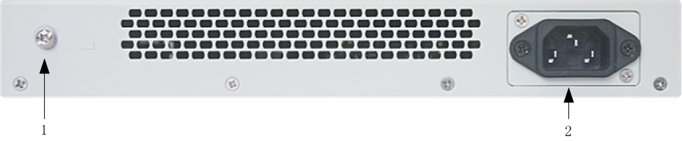
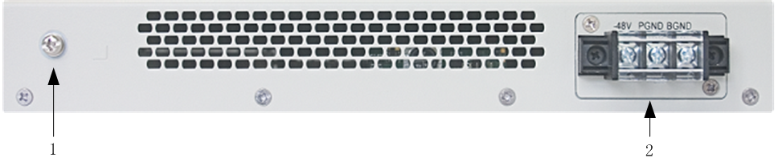
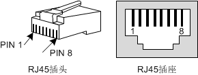
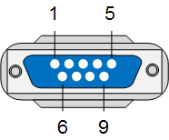
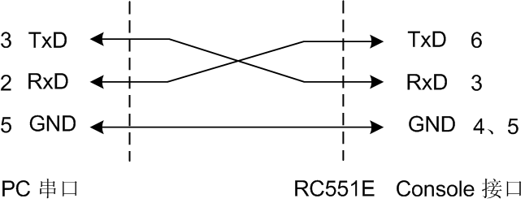
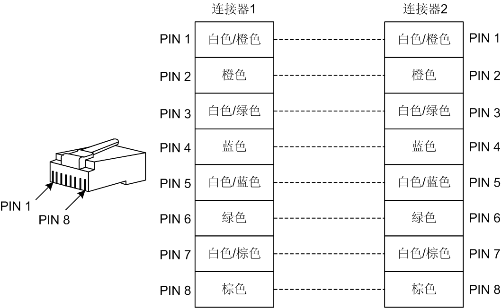
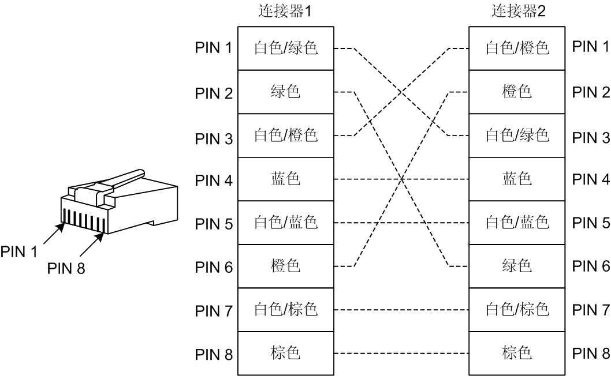
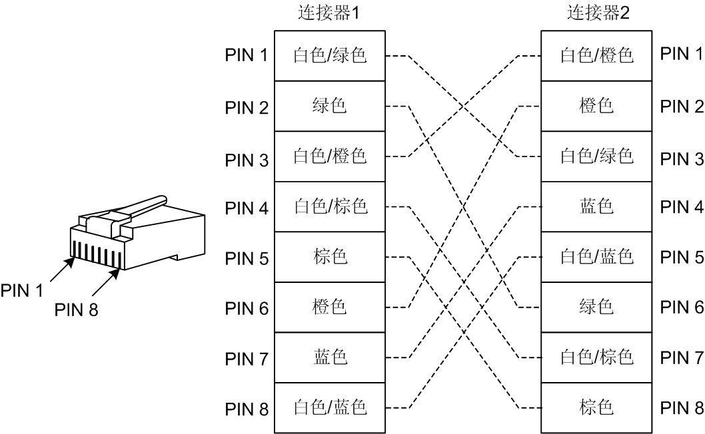

RC551E(C)智能终端用户手册(Rel_01)

瑞斯康达科技发展股份有限公司（以下简称“瑞斯康达”）为客户提供全方位的技术支持和服务。直接向瑞斯康达购买产品的用户，如果在使用过程中有任何问题，可与瑞斯康达各地办事处或用户服务中心联系，也可直接与公司总部联系。

读者如有任何关于瑞斯康达产品的问题，或者有意进一步了解公司其他相关产品，可通过下列方式与我们联系：

公司网址： http://www.raisecom.com

技术支持热线： 400-890-1001，8610-82883110（7×24小时）

技术支持传真： 8610-82885200，8610-82884411

技术支持邮箱： help@raisecom.com

技术文档邮箱： rcdoc@raisecom.com

客户投诉热线： 8610-82345572

公司总部地址： 北京市海淀区西北旺东路10号院（中关村软件园）东区11号

邮政编码： 100094

―――――――――――――――――――――――――――――――――――――――――――――

**声  明**

**Copyright ©2022**

瑞斯康达科技发展股份有限公司

版权所有，保留一切权利。

非经本公司书面许可，任何单位和个人不得擅自摘抄、复制本书内容的部分或全部，并不得以任何形式传播。

是瑞斯康达科技发展股份有限公司的注册商标。

对于本手册中出现的其它商标，由各自的所有人拥有。

由于产品版本升级或其它原因，本手册内容会不定期进行更新。除非另有约定，本手册仅作为使用指导，本手册中的所有陈述、信息和建议不构成任何明示或暗示的担保。

前言

概述

本文档从技术规格、设备外观、安装及使用方法、注意事项的角度介绍了RC551E-4GE设备。

产品版本

与本文档相对应的产品版本如下所示。

| 产品名称           | 硬件版本   |
|--------------------|------------|
| RC551E-4GE智能终端 | C.00及以上 |

约定

符号约定

在本文中可能出现下列标志，它们所代表的含义如下。

| 符号                                            | 说明                                                                                                           |
|-------------------------------------------------|----------------------------------------------------------------------------------------------------------------|
|  | 以本标志开始的文本表示有潜在危险，如果不能避免，可能导致人员伤害。                                             |
|  | 以本标志开始的文本表示有潜在风险，如果忽视这些文本，可能导致设备损坏、数据丢失、设备性能降低或不可预知的结果。 |
|  | 以本标志开始的文本是正文的附加信息，是对正文的强调和补充。                                                     |
|  | 以本标志开始的文本能帮助您解决某个问题或节省您的时间。                                                         |

修订记录

修订记录累积了每次文档更新的说明。最新版本的文档包含以前所有文档版本的更新内容。

文档版本 01 (2021-11-20)

第一次正式发布。

# 技术规格

本章介绍了RC551E-4GE设备的硬件及规格，主要包括：

-   设备概述

-   设备技术规格

-   确认A类设备声明

## 设备概述

RC551E-4GE是实现SNMP和802.3ahOAM功能、支持DHCP远端零配置功能的10/100/1000M以太网智能终端设备。

RC551E-4GE提供4个1000BASE-T以太网电口、2个1000BASE-X
SFP以太网光口、Console口、SNMP口和Reset复位键。

## 设备技术规格

RC551E-4GE设备的技术规格如表1-1所示。

1.  RC551E-4GE技术规格表

| 项目              | 参数                                                                              |
|-------------------|-----------------------------------------------------------------------------------|
| 外形尺寸（mm）    | 260（宽）×180（深）×38（高）                                                      |
| 重量（kg）        | 1.4，可以放置在工作台上。                                                         |
| 工作温度（℃）     | -20～65                                                                           |
| 存储温度（℃）     | -25～70                                                                           |
| 环境湿度          | 10％～90％ RH，无凝结。                                                           |
| 直流电压范围（V） | -18～-72（采用-48V电源时）                                                        |
| 交流电压范围（V） | 100～240V                                                                         |
| 功耗（W）         | ≤15                                                                               |
| 防雷级别          | 交流电源接口：差模6kV、共模6kV 直流电源接口：差模2kV、共模1kV 以太网接口：共模6kV |

## 确认A类设备声明

此为A级产品，在生活环境中，该产品可能会造成无线电干扰。在这种情况下，可能需要用户对干扰采取切实可行的措施。

# 设备外观

本章介绍了RC551E-4GE的设备外观，主要内容包括：

-   设备前面板

-   设备接口

-   设备指示灯

-   设备后面板

-   复位键

## 设备前面板

RC551E-4GE设备的前面板如图2-1所示。

1.  RC551E-4GE设备前面板示意图

## 设备接口

RC551E-4GE接口及用途如表2-1所示。

1.  RC551E-4GE接口类型及用途表

| 接口名称       | 用途                          |
|----------------|-------------------------------|
| CONSOLE        | 控制台接口                    |
| SNMP           | 1000M以太网电口               |
| LINE（5～6）   | 1000M以太网光口 接口形式为SFP |
| CLIENT（1～4） | 10/100/1000M以太网电口        |

## 设备指示灯

RC551E-4GE设备指示灯说明如表2-2所示。

1.  RC551E-4GE设备指示灯说明表

| 接口类型                   | 指示灯  | 状态 | 描述                                                                                                                                                        |
|----------------------------|---------|------|-------------------------------------------------------------------------------------------------------------------------------------------------------------|
| -                          | MNG     | 绿色 | 零配置管理状态指示灯。 常亮：设备处于脱网状态，即设备无管理IP。 快速闪亮：设备处于通过零配置功能申请IP地址状态。 灭：设备处于在网状态，即设备已配置管理IP。 |
|                            | PWR     | 绿色 | 电源指示灯。 常亮：系统供电正常。 灭：系统未供电或供电不正常。                                                                                              |
| SNMP接口                   | LNK/ACT | 绿色 | 常亮：接口连接正常。 闪亮：接口正在接收或发送数据。 灭：接口无连接或连接不正常。                                                                            |
|                            | 1000M   | 黄色 | 常亮：接口工作在1000M状态。 灭：接口无连接或工作在非1000M状态。                                                                                             |
| 以太网电接口（Client1～4） | LNK/ACT | 绿色 | 常亮：电接口连接正常。 闪亮：电接口有数据收发。 灭：电接口无连接或连接不正常。                                                                              |
|                            | 1000M   | 黄色 | 常亮：电接口处于1000M状态。 灭：电接口处于10/100M状态。                                                                                                     |
| 以太网光接口（Line5～6）   | LNK/ACT | 绿色 | 常亮：光接口连接正常。 闪亮：光接口有数据收发。 灭：光接口无连接或连接不正常。                                                                              |

## 设备后面板

RC551E-4GE设备既支持220V交流电源，也支持-48V直流电源，用户可按照需求选择其中的一种。

RC551E-4GE的后面板如图2-2所示。

1.  RC551E-4GE(220V)后面板

后面板功能说明请参见表2-3。

1.  RC551E-4GE(220V)后面板

| 标注 | 用途             |
|------|------------------|
| 1    | 接地螺钉         |
| 2    | 220V交流电源插座 |

RC551E-4GE(-48V)的后面板如图2-3所示。

1.  RC551E-4GE(-48V)后面板

后面板功能说明请参见表2-4。

1.  RC551E-4GE(-48V)后面板

| 标注 | 用途                                                   |
|------|--------------------------------------------------------|
| 1    | 接地螺钉                                               |
| 2    | -48V直流电源插座，其中PGND为机壳地，BGND为-48V电源地。 |

## 复位键

重新启动设备会造成业务中断，请谨慎使用Reset复位键。

在RC551E设备前面板设有针孔式RST复位键，功能如下：

-   短按（时长≤3秒）复位键可以重新启动设备。

-   长按（时长＞3秒）复位键可以恢复出厂配置并重新启动设备。

-   

# 安装及使用方法

本章介绍了RC551E-4GE设备的安装和使用方法，主要内容包括：

-   设备型号

-   设备安装及方法

-   连接设备

-   制作以太网线缆

-   设备加电

## 设备型号

RC551E-4GE的设备型号参见表3-1。

1.  RC551E-4GE的设备型号

| 型号          | 说明                                                                                                        |
|---------------|-------------------------------------------------------------------------------------------------------------|
| RC551E-4GE-AC | 智能终端，提供1个Console口、1个SNMP口、4个1000BASE-T以太网电口和2个1000BASE-X SFP以太网光口，交流220V供电。 |
| RC551E-4GE-DC | 智能终端，提供1个Console口、1个SNMP口、4个1000BASE-T以太网电口和2个1000BASE-X SFP以太网光口，直流-48V供电。 |

## 设备安装及方法

### 环境要求

RC551E-4GE设备两侧和后侧均带有散热孔设计。为确保散热效果，设备两侧和后侧应留有一定空间，或留出空气流动的通道，禁止阻塞散热孔。

### 安装到机架

略

### 接地

为保证人和设备的安全，请将设备的对地接线柱正确接地。

## 连接设备

### 连接到控制台

RC551E-4GE设备提供了RJ-45形式的RS-232接口作为Console口，使用随机提供的电缆线可以将Console口和计算机的串口相连，通过计算机对设备进行配置和管理。

Console口信号定义

RC551E-4GE采用的RJ-45插头和插座对应的引脚编号如图3-1所示。

1.  RJ-45插头和插座对应的引脚编号

Console口对应的引脚功能定义如表3-2所示。

1.  Console口对应的引脚功能定义

| 引脚编号   | 功能 | 类型   |
|------------|------|--------|
| 3          | RxD  | 输入   |
| 6          | TxD  | 输出   |
| 4、5       | GND  | 地     |
| 1、2、7、8 | NC   | 不连接 |

PC的串口信号定义

PC的9针串口插座对应的引脚编号如图3-2所示。

1.  9针串口插座对应的引脚编号

PC的9针串口插座对应的引脚功能如表3-3所示。

1.  9针串口对应的引脚功能定义

| 引脚编号 | 功能 | 类型 | 引脚编号 | 功能 |
|----------|------|------|----------|------|
| 1        | CD   |      | 6        | DSR  |
| 2        | RxD  | 输入 | 7        | RTS  |
| 3        | TxD  | 输出 | 8        | CTS  |
| 4        | DTR  | -    | 9        | RI   |
| 5        | GND  | 接地 | -        | -    |

Console口连接方式和参数设置

RC551E-4GE智能终端设备的Console接口和PC串口连接方式如图3-3所示。

1.  设备的Console接口和PC串口连接方式示意图

在计算机上终端仿真程序连接参数设置如下：

-   波特率：9600

-   数据位：8

-   停止位：1

-   奇偶校验位：None

-   流量控制：无

### 连接到以太网

RC551E-4GE智能终端设备的10/100/1000M以太网电口和1000M
SNMP口均具有自动交叉功能，即能够自动进行MDI和MDI-X的切换。无论对端采用MDI还是MDI-X，无论采用直通网线还是交叉网线，都能正常连接。

针对RJ-45接口来说，MDI和MDI-X信号定义如表3-4所示，RJ-45插头和插座对应的引脚编号如表3-4所示。

1.  RJ-45接口对应的引脚功能定义

| 引脚编号   | 功能 | 类型 |
|------------|------|------|
| 1          | RD+  | TD+  |
| 2          | RD-  | TD-  |
| 3          | TD+  | RD+  |
| 6          | TD-  | RD-  |
| 4、5、7、8 | NC   | NC   |

RC551E-4GE智能终端设备的以太网光口为SFP形式。使用时请选择速率为1.25Gbit/s的SFP光模块，其他参数（传输距离、介质类型等）可根据实际需要选择。将SFP模块插入以太网光口，使用一对一端为SC类型的光纤（光纤的另一端类型取决于对端设备）与其他1000Base-X设备相连，确保两端SFP模块的收发方向匹配。

该以太网光口同时还支持100BASE-FX SFP、1000BASE-T SFP、10/100/1000BASE-T
SFP三种规格。

### 连接电源

根据电源模块类型及工作场景的不同，需选择使用不同的电源线缆。设备接地端子连接保护地线，也可通过电源线接地，设备类别为I类。

RC551E-4GE采用随智能终端设备提供的电源线将交换机后面板的电源接口和220V（或-48V）电源相连。

## 制作以太网线缆

以太网线缆分为直通网线和交叉网线两类：

-   直通网线：用于连接不同类型设备，比如PC和交换机，交换机和路由器。

-   交叉网线：用于连接同类型设备，比如PC和PC，交换机和交换机，路由器和路由器，PC和路由器（PC和路由器归为一类）。

EIA/TIA568A标准线序与EIA/TIA568B标准线序说明如表3-5所示。

1.  EIA/TIA568A标准线序与EIA/TIA568B标准线序

| 连接器1（RJ45） | EIA/TIA568A标准线序 | 连接器2（RJ45） | EIA/TIA568B标准线序 |
|-----------------|---------------------|-----------------|---------------------|
| PIN 1           | 白色/绿色           | PIN 1           | 白色/橙色           |
| PIN 2           | 绿色                | PIN 2           | 橙色                |
| PIN 3           | 白色/橙色           | PIN 3           | 白色/绿色           |
| PIN 4           | 蓝色                | PIN 4           | 蓝色                |
| PIN 5           | 白色/蓝色           | PIN 5           | 白色/蓝色           |
| PIN 6           | 橙色                | PIN 6           | 绿色                |
| PIN 7           | 白色/棕色           | PIN 7           | 白色/棕色           |
| PIN 8           | 棕色                | PIN 8           | 棕色                |

直通网线

直通网线要求两端RJ45连接器使用同样的标准线序，通常为EIA/TIA568B标准线序，接线图如图3-4所示。

1.  直通网线接线图

交叉网线

100Mbit/s交叉网线与1000Mbit/s交叉网线标准线序的制作略有不同。

100Mbit/s交叉网线一端RJ45连接器为EIA/TIA568A标准线序，另一端为EIA/TIA568B标准线序，100Mbit/s交叉网线接线图如图3-5所示。

1.  100Mbit/s交叉网线接线图

1000Mbit/s交叉网线用到了双绞线的全部8根，线缆两端除了PIN 1、PIN 2和PIN 3、PIN
6线序对调以外，PIN 4、PIN 5和PIN 7、PIN
8线序也要对调。1000Mbit/s交叉网线接线图如图3-6所示。

1.  1000Mbit/s交叉网线接线图

瑞斯康达公司可提供直通网线和100Mbit/s交叉网线。两类网线仅名称不同，直通网线为CBL-ETH-RJ45/RJ45-D，交叉网线为CBL-ETH-RJ45/RJ45-X-D。两类网线线缆技术指标如表3-6所示。

1.  网线线缆技术指标

| 项目       | 描述                                                                                          |
|------------|-----------------------------------------------------------------------------------------------|
| 线缆颜色   | 深灰色                                                                                        |
| 线缆型号   | 5类或以上非屏蔽双绞线（UTP-5、UTP-5e）或屏蔽双绞线（STP）                                     |
| 连接器类型 | RJ45连接器                                                                                    |
| 芯数       | 8芯                                                                                           |
| 长度       | 线缆长度D，根据客户需求定制。例如：客户需求线缆长度为2 米，则线缆名称为“CBL-ETH-RJ45/RJ45-2m” |

## 设备加电

-   按照以上步骤对RC551E-4GE设备进行正确安装后，用电源线将设备和220V电源相连，即对设备加电。

-   加电后，PWR指示灯常亮，表示系统已经供电。

-   前面板所有指示灯点亮，表示RC551E-4GE设备正在进行自检和初始化。

-   RC551E-4GE设备经过自检和初始化，进入工作状态。以太网口的指示灯指示端口状态（依端口设定和连接显示亮或者灭）。

-   如果加电前，RC551E-4GE设备的Console口连接了计算机，并且正确配置了终端软件，此时计算机上将显示用户管理界面，可供操作。

# 注意事项

在RC551E-4GE设备的安装、维护、拔插部件时，一定要由合格的技术支持人员来操作。要将设备安装在一间温度和湿度都可以控制的设备房中，如果湿度太大，可能造成短路；如果房间太干燥的话，也可能引起火灾。另外还要注意设备放置处物质的导电性。

-   机箱必须接地，以防止静电。

-   RC551E-4GE设备在安装时，应与临近的用电设备保持一定的距离。

-   RC551E-4GE设备的机外布线最好与火线交叉通过，并尽量避免长距离靠近并行。

-   请严格按照手册中的说明进行操作。

-   注意防潮，请在双手干燥时操作RC551E-4GE设备。

-   禁止对RC551E-4GE设备进行机械和电气改造。

